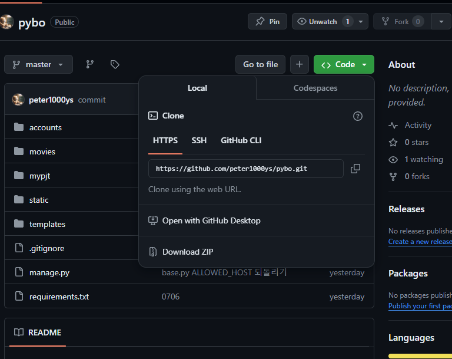

# 서버에 장고 연결

# hostname 변경

```java
ubuntu@ip-172-26-1-61:~$
```

위 와 같이 서버의 호스트명은 ip 주소 형태로 나온다.

```java
sudo hostnamectl set-hostname 바꾸고_싶은_호스트명
```

나 같은 경우 그냥 깃헙 아이디로 설정 ⇒ 적용 시키기 위해 서버 리부트

```java
sudo reboot
```

그러면 바뀌어 있는 것을 확인할 수 있다.

`hostname` 명령어를 치면 변경된 호스트명이 출력된다.

```java
hostname
```

---

## 서버 시간 설정하기

`date` 명령어로 시간을 확인 해보면 우리나라 시간이 아닌 UTC 시간으로 표시된다

```java
ubuntu@jumpto:~$ date
Sun Apr 26 06:56:34 UTC 2020
```

한국 시간으로 설정하기 위해 다음 코드 수행

```java
ubuntu@jumpto:~$ sudo ln -sf /usr/share/zoneinfo/Asia/Seoul /etc/localtime
```

다시 `date` 명령어를 입력해보면 KST로 바뀐 것을 볼 수 있다.

```java
ubuntu@jumpto:~$ date
Sun Apr 26 16:07:21 KST 2020
```

---

## 파이썬 설치 확인

`python` 명령어를 통해 설치를 확인해보자

```java
ubuntu@jumpto:~$ python

Command 'python' not found, but can be installed with:

sudo apt install python3       
sudo apt install python        
sudo apt install python-minimal

You also have python3 installed, you can run 'python3' instead.
```

`python3` 을 입력해보라고 하니 입력해보자

```java
ubuntu@jumpto:~$ python3
Python 3.8.2 (default, Apr 27 2020, 15:53:34)
[GCC 9.3.0] on linux
Type "help", "copyright", "credits" or "license" for more information.
>>>
```

파이썬 쉘이 실행, 파이썬이 설치되어 있는 것을 확인 했으니 `exit()`로 쉘 종료

---

## 가상 환경 설치

진행하기 전 `sudo apt update` 를 통해 우분투 패키지를 최신으로 업그레이드

```java
ubuntu@jumpto:~$ sudo apt update
Hit:1 http://ap-northeast-2.ec2.archive.ubuntu.com/ubuntu focal InRelease
(... 생략 ...)
Fetched 17.7 MB in 7s (2648 kB/s)
Reading package lists... Done
Building dependency tree
Reading state information... Done
137 packages can be upgraded. Run 'apt list --upgradable' to see them.
```

`sudo apt install python3-venv` 를 통해 `python3-venv` 패키지를 설치 ⇒ 모두 엔터키로 넘긴다

```java
ubuntu@jumpto:~$ sudo apt install python3-venv
Reading package lists... Done
Building dependency tree
(... 생략 ...)
```

홈 디렉터리(/home/ubuntu) 하위에 필요한 projects, vemv 디렉토리 생성

```java
ubuntu@jumpto:~$ mkdir projects
ubuntu@jumpto:~$ mkdir venvs
ubuntu@jumpto:~$ ls
projects venvs
```

터미널에서 보이는 `ubuntu@jumpto:~$` 프롬프트에서 '~'는 홈 디렉터리인 /home/ubuntu를 의미한다.

venvs 디렉토리로 이동해 장고 가상환경을 생성

```java
ubuntu@jumpto:~$ cd venvs
ubuntu@jumpto:~/venvs$ python3 -m venv mysite
ubuntu@jumpto:~/venvs$ 
```

가상환경 진입

```java
ubuntu@jumpto:~/venvs$ cd mysite
ubuntu@jumpto:~/venvs/mysite$ cd bin
ubuntu@jumpto:~/venvs/mysite/bin$ . activate
(mysite) ubuntu@jumpto:~/venvs/mysite/bin$
```

`. activate` 명령을 수행하면 가상환경으로 진입할 수 있다 ⇒ 대신 `source activate` 명령을 사용 가능
가상 환경에서 벗어나려면 아무 곳에서나 `deactivate` 명령을 수행

---

## wheel 패키지 설치

서버 환경에서는 pip으로 파이보 관련 패키지를 설치하면 wheel 패키지와 관련된 오류가 발생할 수 있다. 그러므로 `pip install wheel` 명령으로 wheel 패키지를 먼저 설치

```java
(mysite) ubuntu@jumpto:~/venvs/mysite/bin$ pip install wheel
```

장고와 마크다운 패키지도 설치

```java
(mysite) ubuntu@jumpto:~/venvs/mysite/bin$ pip install django==4.0.3
(mysite) ubuntu@jumpto:~/venvs/mysite/bin$ pip install markdown
```

---

## 장고 파일 연결하기

깃허브 원격 저장소에 저장해둔 실행하고 싶은 장고 프로젝트를 내려 받자.

아까 만들어 둔 projects 디렉토리에 클론을 해주자

```java
(mysite) ubuntu@jumpto:~/venvs/mysite/bin$ cd ~/projects
(mysite) ubuntu@jumpto:~/projects$ 
```



```java
(mysite) ubuntu@jumpto:~/projects$ git clone https://github.com/peter1000ys/pybo.git mysite
Cloning into 'mysite'...
remote: Enumerating objects: 62, done.
remote: Counting objects: 100% (62/62), done.
remote: Compressing objects: 100% (44/44), done.
remote: Total 62 (delta 14), reused 62 (delta 14), pack-reused 0
Unpacking objects: 100% (62/62), done.
```

`ls` 명령을 수행해 보면 mysite 디렉터리가 생성되었음을 확인할 수 있다.

```java
(mysite) ubuntu@jumpto:~/projects$ ls
mysite
```

---

## 데이터베이스 생성

```java
(mysite) ubuntu@jumpto:~/projects$ cd mysite
(mysite) ubuntu@jumpto:~/projects/mysite$ python manage.py runserver
Watching for file changes with StatReloader
Performing system checks...

System check identified no issues (0 silenced).

You have 23 unapplied migration(s). Your project may not work properly until you apply the migrations for app(s): admin, auth, contenttypes, pybo, sessions.
Run 'python manage.py migrate' to apply them.

April 23, 2020 - 19:48:24
Django version 3.0.5, using settings 'config.settings'
Starting development server at http://127.0.0.1:8000/
Quit the server with CONTROL-C.
```

장고 서버는 실행되지만, `python manage.py migrate` 명령을 수행하라는 메시지
 깃허브에는 `.gitignore`에 의해 `db.sqlite3` 파일이 저장되지 않았기 때문
데이터베이스를 생성하기 위한 작업 파일들은 `pybo/migrations` 디렉터리에 존재하므로 makemigrations 명령을 수행할 필요 없이 `python manage.py migrate` 명령만으로 데이터베이스를 생성할 수 있다.
`<Ctrl+C>` 키를 입력하여 장고 서버를 종료하고 다음과 같이 migrate 명령을 수행

```java
(mysite) ubuntu@jumpto:~/projects/mysite$ python manage.py migrate
Operations to perform:
  Apply all migrations: admin, auth, contenttypes, pybo, sessions
Running migrations:
  Applying contenttypes.0001_initial... OK
  Applying auth.0001_initial... OK
  Applying admin.0001_initial... OK
  (... 생략 ...)
  Applying pybo.0006_auto_20200423_1358... OK
  Applying sessions.0001_initial... OK
```

<aside>
💡 서버 환경에서는 makemigrations로 마이그레이션용 파일을 만들지 않는 것이 좋다. 로컬서버에서 완성된 마이그레이션용 파일을 가지고 서버에서는 해당 파일을 확인후에 migrate만 수행하는 것이 안전한 방법이다.

</aside>