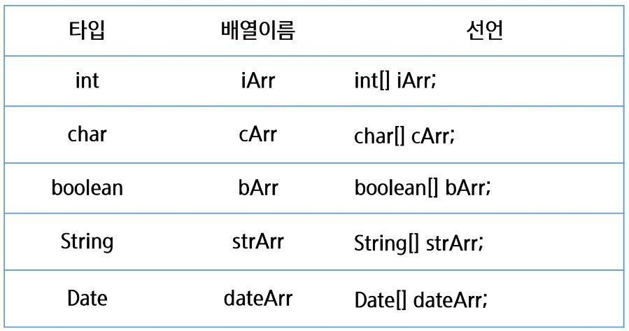

# 1차원 배열

Tags: 1차원 배열

# 배열

- 같은 종류의 데이터를 저장하기 위한 자료 구조
- **크기(원소의 개수 = 배열의 크기 = 배열의 길이) 고정**
- 배열을 객체로 취급 (참조형)
- 배열의 요소를 참조하려면 배열 이름과 index라고 하는 음이 아닌 정수 값을 조합하여 사용
- 인덱스 번호를 가지고 각 요소에 접근
- 인덱스 번호는 0부터 시작
- `배열이름.length`를 통해 배열의 길이 조회 가능
- 배열의 길이를 임의로 변경 불가함
- 길이 변경 필요 시 새로운 배열을 생성 후 내용을 옮긴다.

### 배열의 선언

**`타입[] 변수`**


### 배열의 생성과 초기화

- `자료형[] 배열이름 = new 자료형[길이];` 배열 생성(자료형의 초기값으로 초기화)
- `자료형[] 배열이름 = new 자료형[]{값1, 값2, 값3, 값4};` 배열 생성 및 값 초기화
- `자료형 [] 배열이름 = {값1, 값2, 값3, 값4};` 선언과 동시에 초기화

```java
public class Array01 {
    public static void main(String[] args) {
        // 1차원 배열의 선언
        // 배열을 가리키는 참조값을 저장할 배열 변수만 선언된 것일 뿐
        // 실제 배열 객체가 생성된 것은 아님
        // 배열 변수에는 배열 객체의 주소값이 저장됨(참조형)
        int[] score1;
        int score2[];

        // 1차원 배열 생성
        // 자료형[] 변수명 = new 자료형 [길이];
        int[] score3 = new int[5];
        // 길이와 초기값은 동시에 정할 수 없다
        // 자료형 변수명 = new 자료형[] {값1, 값2, 값3, 값4};
        int[] score4 = new int[]{1, 2, 3, 4};
        // 선언과 동시에 할 때만 사용 가능
        // 선언만 하고 나중에 할당할 때는 사용 불가능
        int[] score5 = {1, 2, 3, 4};

        score3[0] = 10;
        score3[1] = 20;
    }
}
/////////////////////////////////////////////////////////////

public class Array02 {
    public static void main(String[] args) {
        // 기본형
        boolean[] bArr = new boolean[5];
        char[] cArr = new char[5];
        float[] fArr = new float[5];
        // 참조형
        String[] strArr = new String[5];

        System.out.println(bArr[0]);
        System.out.println(cArr[0]);
        System.out.println(fArr[0]);
        System.out.println(strArr[0]);
    }
}

```

### 배열의 순회

반복문을 이용하여 배열의 요소를 순회할 수 있음

```java
int[] intArray = {1, 3, 5, 7, 9};
for (int i=0; i<intArray.length; i++){
    System.out.println(intArray[i]);
}
for (int i=0; i<intArray.length; i++){
            int x = intArray[i];
            System.out.println(x);
        }
```

### 배열의 출력

- 반복문을 통해서 출력
- Arrays.toString(배열): 배열 안의 요소를 [값1, 값2…] 형태로 출력

```java
System.out.println(Arrays.toString(intArray));
```

### 배열의 복사

- 배열은 생성하면 길이가 불변으로 더 많은 저장공간이 필요하다면 큰 배열을 생성하고 이전 배열의 값을 복사 해야함
- 새로운 배열 = Arrays.copyOf(복사하고 싶은 배열, 새로운 배열 크기)
- System.arraycopy(Object src, int srcPos, Object dest, int destPos, int length)

```java
import java.util.Arrays;

public class Array04 {
    public static void main(String[] args) {
        int[] nums = {13, 56, 1, 99, 85};

        // 반복문을 이용한 방법
        int[] tmp = new int [nums.length*2];

        for (int i = 0; i < nums.length; i++) {
            tmp[i] = nums[i];

        }

        System.out.println(Arrays.toString(tmp));

        int[] tmp2 = Arrays.copyOf(nums,10);
        System.out.println(Arrays.toString(tmp2));

        int[] tmp3 = new int[10];
        System.arraycopy(nums,0,tmp3,0,nums.length);

    }
}

```