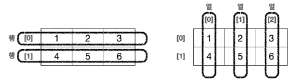

# 2차원 배열

## 2차원 배열 선언

2차원 배열도 생각 보다 간단하다. 만약 2행 3열의 2차원 배열을 생성하고 싶다면  `int[][] arr = new int[2][3]` 와 같이 선언하고 생성하면 된다.


그리고 arr[행][열] , arr[row][column] 과 같은 방식으로 각 배열에 들어 있는 데이터에 접근이 가능하다.

### 벼열의 초기화와 길이

```java
public class ArrayDi3 {
 public static void main(String[] args) {
 // 2x3 2차원 배열, 초기화
 int[][] arr = {
 {1, 2, 3},
 {4, 5, 6}
 };
 // 2차원 배열의 길이를 활용
 for (int row = 0; row < arr.length; row++) {
 for (int column = 0; column < arr[row].length; column++) {
 System.out.print(arr[row][column] + " ");
 }
 System.out.println();
 }
 }
}
```

arr.length는 행의 길이를 뜻한다.  

arr[row].length는 열의 길이를 뜻함.

```java
package array1;

public class Array1 {
    public static void main(String[] args) {
        int [][] arr = new int[2][3];
        int a = 1;
        // 순서대로 1씩 증가하는 값을 입력
        for (int i = 0; i < arr.length; i++) {
            for (int j = 0; j < arr[i].length; j ++) {
                arr[i][j] = a ++;
            }
        }

        for (int i = 0; i < arr.length; i++) {
            for (int j = 0; j < arr[i].length; j ++) {
                System.out.print(arr[i][j] + " ");
            }
            System.out.println();
        }
    }
}
/*
결과
1 2 3 
4 5 6 
*/
```

## 향상된 for문

이제 배열을 활용하여 더 간결한 for문을 작성해 보자

```java
package array1;

public class Array2 {
    public static void main(String[] args) {
        int [] arr = {1, 2, 3, 4, 5};
        for (int num : arr) {
            System.out.println(num);
        }
    }
}

```

- `:`의  오른쪽에 탐색할 배열을 선택하고, 왼쪽에는 반복할 때 마다 찾은 값을 저장할 변수를 선언
- 배열의 인덱스를 사용하지 않고도 배열의 요소를 순회할 수 있기 때문에 코드가 간결하고 가독성이 좋아진다.

### 향상된 for문을 사용하지 못하는 경우

- 향상된 for문을 사용하면 해당 배열의 인덱스에 값을 직접 사용할 수 없다. 억지스러운 방법으로 사용할 수 있지만, 그럴거면 일반 for문을 사용하는 것이 현명하다.