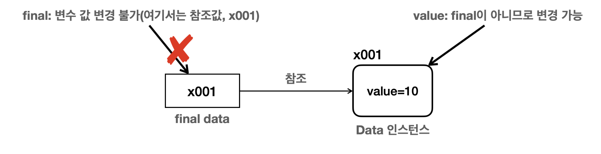

# final

## final 변수와 상수

변수에 final 키워드가 붙으면 더 이상 값을 변경할 수 없다는 뜻.

final은 클래스나 메서드를 포함한 여러 곳에 붙을 수 있다.

### final - 지역 변수

```java
package final1;

public class FinalLocalMain {
		public static void main(String[] args) { //final 지역 변수1
				final int data1;
				data1 = 10; //최초 한번만 할당 가능 //data1 = 20; //컴파일 오류
				//final 지역 변수2
				final int data2 = 10; //data2 = 20; //컴파일 오류
		    method(10);
		     }
		//final 매개변수
		static void method(final int parameter) {
				//parameter = 20; 컴파일 오류
		} 

}
```

- final 지역 변수는 최초 한 번만 할당이 가능하다. 이후에 값을 할당할 경우 컴파일 에러가 발생한다.
- final을 지역 변수 선언 시 바로 초기화한 경우 이미 값이 할당되었기 때문에 값을 할당할 필요 없다.
- 매개 변수에 final이 붙으면 메서드 내부에서 매개변수 값을 변경할 수 없음. 따라서 메서드 호출 시점에 사용된 값이 끝까지 사용됨.

### final - 필드(멤버 변수)

```java
package final1;
//final 필드 - 생성자 초기화 
public class ConstructInit {
     final int value;
     public ConstructInit(int value) {
         this.value = value;
		}
}
//final 필드 - 필드 초기화 
public class FieldInit {
     static final int CONST_VALUE = 10;
     final int value = 10;
 }
```

- final을 필드에 사용할 경우 해당 필드는 생성자를 통해서  한번만 초기화 할 수 있다.
- static 변수에 final 사용 가능
- 생성자를 사용한 초기화의 경우, 각 인스턴스마다 final 필드에 다른 값을 할당할 수 있다. 물론 생성 이후에는 변경 불가이다.
- 필드를 사용한 초기화의 경우, 필드의 코드에 해당 값은 이미 정해져 있어서 변경이 불가능하다.
    - 여러 인스턴스가 같은 값을 사용하기 때문에 이는 메모리 낭비로 이어질 수 있다.
- `static final`
    - static 영역은 단 하나만 존재하는 영역. 그러니 중복과 메모리 비효율 문제를 모두 해결할 수 있다.
    - 필드에서 final + 필드 초기화를 하는 경우는 static을 붙여서 사용하는 것이 효과적이다.

---

### 상수

- 상수는 변하지 않고 항상 일정한 값을 갖는 수를 말한다.
- 자바에서는 단 하나의 변하지 않는 고정된 값을 상수라고 표현
- `static final` 키워드를 사용
- 대문자를 사용하고 구분은 `_` 로 한다 ⇒ 변수와 상수 구분을 위해 사용
- 필드를 직접 접근하여 사용
    - 상수는 기능이 아니라 고정된 값 자체를 사용하는 것이 목적
    - 상수 값은 변경 불가, 따라서 필드에 접근해도 데이터가 변하는 문제가 발생하지 않는다.
- 중앙에서 값을 하나로 관리할 수 있어서 좋다.
- 런타임에 변경할 수 없음. 상수를 변경하려면 프로그램을 종료시키고 코드를 변경한 다음에 프로그램을 다시 실행해야 한다.

---

### 참조형 변수

참조형 변수는 객체의 참조 값을 보관한다.

final을 참조형 변수에 사용하면 참조값을 변경할 수 없다.

- final을 사용하고 참조값을 할당하면 더이상 다른 참조값으로 변경이 불가능하다.
    - 하지만 해당 참조값에 속해 있는 변수의 값은 변경이 가능하다.




<aside>
💡 참조형 변수에 final이 붙으면 참조 대상을 자체를 다른 대상으로 변경하지 못하는 것이지, 참조하는 대상의 값은 변경할 수 있다.

</aside>