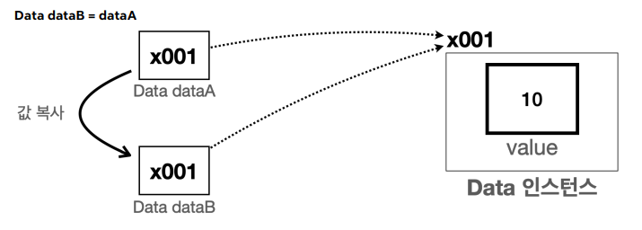

# 기본형과 참조형

데이터 타입을 가장 크게 나눈 개념이 기본형과 참조형이다.

**기본형** : int, double 등 처럼 변수에 사용할 값을 직접 넣을 수 있는 데이터 타입

**참조형** : Restaurant restaurant1, int[] restaurants 처럼 데이터에 접근하기 위한 주소(참조값)를 저장하는 데이터 타입. 객체 또는 배열을 사용

- 객체는 `.` 을 이용하여 메모리상 생성된 객체를 찾아 사용
- 배열은 `[]` 을 통해 메모리 상에 생성된 배열을 찾아 사용

### 기본형 참조형 - 계산

- 기본형은 변수 자체에 값이 들어 있기 때문에 바로 계산에 사용이 가능하다
- 참조값은 말 그대로 주소이므로 바로 계산에 사용하면 오류 발생, 안에 위치한 멤버 변수에 접근하여 연산이 가능하다.

<aside>
💡 **String의 경우**
String은 클래스이기 때문에 참조형에 해당한다. 하지만 자바에서 문자는 자주 다루기 때문에 편의를 제공하여 기본형처럼 바로 바로 사용이 가능하다.

</aside>

### 기본형 참조형 - 변수 대입

자바에서는 항상 변수의 값을 복사해서 대입한다. 

그러니 기본형은 변수에 들어있는 실제 값을 복사하여 대입하고, 참조형은 실제 사용하는 객체가 아니라 객체의 위치를 가리키는 참조값을 복사해서 대입한다. 그러니 참조형 대입은 해당 객체로 가는 길이 하나 더 늘어난 셈이다.

예를 들어 그림처럼 Data객체의 참조값을 저장한 변수 dataA를 dataB에 대입했을 때, dataB는 dataA가 갖고 있던 Data객체로의 주소값만 복사가 된 것이다. 그래서 dataA를 통해 객체의 멤버변수의 값을 바꾸면 dataB로 해당 멤버 변수에 접근하여도 값이 바뀐 값을 가져온다. 그 반대도 해당된다. 

### 기본형 참조형 - 메서드 호출

메서드 호출도 기본 개념은 비슷하다. 기본적으로 메서드를 호출할 때 사용하는 매개변수도 결국 변수이다. 그러니 메서드를 호출할 때 매개변수에 값을 전달하는 것도 값을 복사해서 전달하는 것.

메서드에 전달되는 값이 실제 값이냐, 참조값이냐에 따라 결과가 달라진다.

**기본값** : 메서드로 기본형 데이터를 전달 받으면 해당 값을 복사해서 전달. 이 경우, 메서드 내부에서 매개변수의 값을 변경해도, 호출자의 변수 값에는 영향이 없다.

**참조값** : 메서드로 참조형 데이터를 전달하면, 참조값이 복사되어 전달. 이 경우, 메서드 내부에서 매개변수로 전달된 객체의 멤버 변수를 변경하면 호출자의 객체에도 영향이 간다.

---

### 변수의 값 초기화

멤버 변수 : 자동으로 초기화

- 인스턴스의 멤버 변수는 인스턴스 생성 시 자동으로 초기화된다.

지역 변수 : 수동으로 초기화

### null

참조형 변수에서 아직 기리키는 대상이 없다면 null을 사용하여 값이 존재하지 않다는 사실을 넣어 놓는다. 

만약 null을 사용하여 한 객체에 대한 참조값들을 모두 지우면 어떻게 될까? 

자바에서는 더 이상 참조하는 값이 없는 객체는 사용하지 않는 데이터로 취급하여 자동으로 메모리에서 삭제해준다.

### NullPointerException

만약 객체를 참조하는 값이 존재하지 않은 상태에서 해당 객체에 접근하면 어떻게 될까?

당연히 에러가 발생한다. NullPointerException는 그러한 상황에 발생하는 에러이다.

우리는 흔히 객체에 접근할 때 `.` 을 이용하여 접근한다. 여기서 참조값을 null로 바꾼 상태에서 그 null 값에 `.` 을 이용하면 해당 에러가 발생한다.