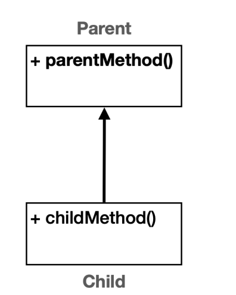
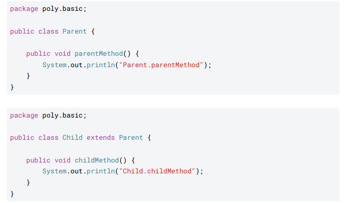
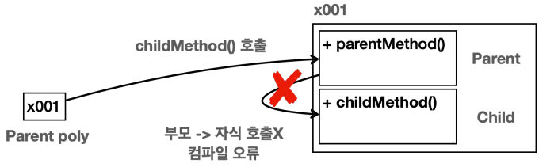
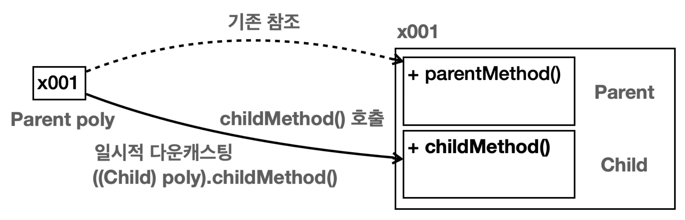
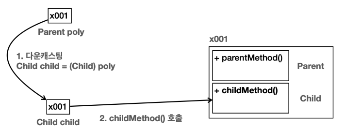
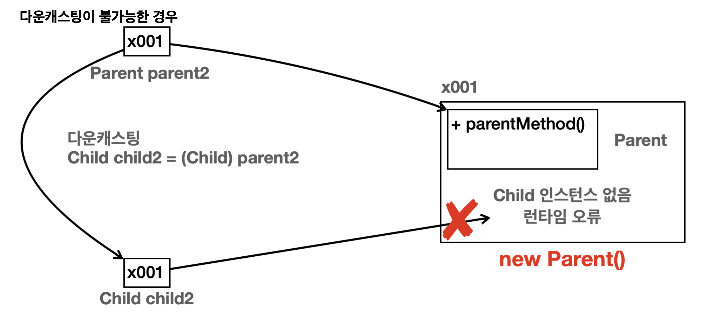
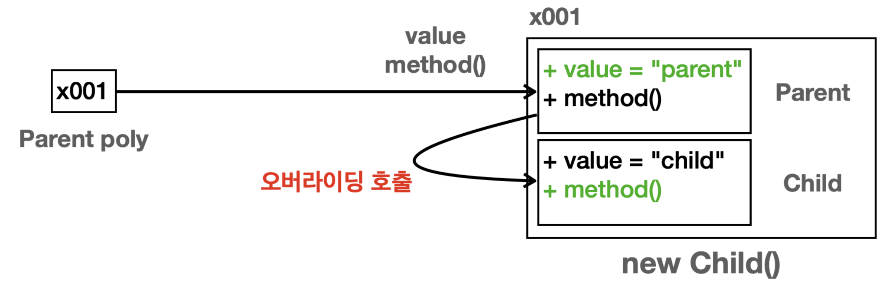

# 다형성

## 다형성 Polymorphism

**사전적 의미** : 다양한 형태, 여러 형태

**프로그램적 의미** : 한 객체가 여러 타입의 객체로 취급될 수 있는 능력

다형성을 이해하기 위해서는 핵심 이론인 **다형적 참조**와 **메서드 오버라이딩**을 알아야 한다.

---

# 다형적 참조





다음과 같은 상속 관계를 가지는 Parent와 Child 클래스가 존재한다고 하자.

다형적 참조는 부모는 자식을 품을 수 있다는 점이다.

```java
public class PolyMain {
		public static void main(String[] args) {
		//부모 변수가 부모 인스턴스 참조
				System.out.println("Parent -> Parent");
				Parent parent = new Parent();
				parent.parentMethod();
				//자식 변수가 자식 인스턴스 참조
				System.out.println("Child -> Child");
				Child child = new Child();
				child.parentMethod();
				child.childMethod();
				//부모 변수가 자식 인스턴스 참조(다형적 참조)
				System.out.println("Parent -> Child");
				Parent poly = new Child();
				poly.parentMethod();
				//Child child1 = new Parent(); 자식은 부모를 담을 수 없다.
				//자식의 기능은 호출할 수 없다. 컴파일 오류 발생
				//poly.childMethod();
		}
}
```

부모 타입의 변수가 자식 인스턴스 참조 ⇒ **다형적 참조**

`Parent poly = new Child()`

- Child 인스턴스가 생성된다. 자식 타입인 Child가 생성되었기 때문에 메모리 상에 Child와 Parent 모두 생성
- 생성된 참조값을 Parent 타입의 변수인 poly에 저장한다.
- 부모는 자식을 담을 수 있다.
- 반대로 자식 타입은 부모 타입을 담을 수 없다.
- Parent 타입의 변수는 다음과 같이 자신인 Parent 는 물론이고, 자식 타입까지 참조할 수 있다. 만약 손자가 있다면 손자도 그 하위 타입도 참조할 수 있다.

**자바에서 부모 타입은 자신은 물론이고, 자신을 기준으로 모든 자식 타입을 참조할 수 있다**

### 다형적 참조의 한계

`poly.childMethod()`의 상황



**Parent poly = new Child() 이렇게 자식을 참조한 상황에서 poly 가 자식 타입인 Child 에 있는
childMethod() 를 호출할 수 있을까?**

답은 아니다. poly는 Parent 타입이므로 Parent 클래스부터 검색을 하는데 여기에 없다면 검색을 할 수 없다. 왜냐면 상속 관계에서는 부모 방향으로 올라가면서 검색은 가능하지만 자식 방향으로 내려가면서 검색을 할 수 없기 때문이다.

이 문제는 캐스팅을 통해 해결이 가능하다.

---

## 캐스팅

### 캐스팅이란?

현재 상태를 다른 특정한 형태나 모양으로 만드는 과정이다.

## 캐스팅 종류

- 업캐스팅 : 부모 타입으로 변경
- 다운캐스팅 : 자식 타입으로 변경

### 일시적 다운 캐스팅

다운캐스팅의 캐스팅 결과를 변수에 담아두는 과정이 번거롭다. 이런 과정 없이 일시적으로 다운캐스팅 하는 방법으로 이용하면 이를 해결할 수 있다.

```java
//일시적 다운캐스팅 - 해당 메서드를 호출하는 순간만 다운캐스팅
((Child) poly).childMethod();
```



여기서 Parent 타입인 poly가 Child 타입으로 바뀌는 것이 아니라 poly에서 참조값(x001)을 꺼낸 후 그 참조값이 Child타입으로 변하는 것이다.

자식 타입을 부모 타입으로 변경하는 과정.

### 업캐스팅

```java
Parent parent1 = (Parent) child; //업캐스팅은 생략 가능, 생략 권장 
Parent parent2 = child; //업캐스팅 생략
```

업캐스팅은 다운캐스팅과 달리 생략이 가능하다. ⇒ 자주 사용하니 생략을 권장한다.

명심하자, 자바에서 부모는 자식을 담을 수 있지만 그 반대는 안되기에 다운캐스팅을 하는 것이다.

### 다운 캐스팅

호출하는 타입을 자식 타입으로 변경하면 인스턴스의 자식 클래스에 있는 메서드를 호출할 수 있다.

하지만 **부모는 자식을 담을 수 있지만 자식은 부모를 담을 수 없다.**

부모 타입을 사용하는 변수를 자식 타입에 대입하려고 하면 컴파일 에러가 발생한다. 하지만 다운 캐스팅을 이용하면 부모 타입을 잠깐 자식 타입으로 변경 가능하다.

`Child child = (Child) poly;` 

(타입)처럼 괄호와 그 사이에 타입을 지정해주면 촘조 대상을 특정 타입으로 변경이 가능하다. 이렇게 **특정 타입으로 변경하는 것을 캐스팅**이라고 한다.

- Parent 타입인 poly를 일시적으로 자식 타입으로 변경하고 왼쪽에 있는 child에 대입하는 과정이다.



### 다운캐스팅의 주의점

- 잘못된 다운캐스팅은 심각한 런타임 오류로 이어진다.

```java
Parent parent2 = new Parent();
Child child2 = (Child) parent2; //런타임 오류 - ClassCastException 
child2.childMethod(); //실행 불가
```



부모 타입의 객체를 생성하면 따로 메모리상에 자식 타입이 생성되지 않는다. 그러니 메모리 상 Child 자체가 존재하지 않아 사용을 할 수 없는 것이다.

이런식으로 사용할 수 없는 다운캐스팅의 경우 `ClassCastException`이라는 예외가 발생한다. 예외가 발생되면 다음 동작이 실행되지 않고 프로그램이 종료된다. 그러니 다음 코드 자체가 실행이 안되는 것이다.

### 업캐스팅이 다운캐스팅보다 안전한 이유

업캐스팅 같은 경우 객체를  생성할 때 해당 타입의 모든 상위 부모 타입도 같이 생성된다. 그러니 위로만 타입을 변경하는 업캐스팅은 해당 예외가 발생할 수 없다. 메모리 상에 인스턴스가 모두 존재하기 때문에 항상 안전하여 생략이 가능하다.

다운캐스팅은 위와 같은 예외가 발생하지 않도록 문제를 인지하고 명시적으로 캐스팅 해주어야 한다.

<aside>
💡 **컴파일 오류 vs 런타임 오류**
컴파일 오류 : 변수명 오타, 잘못된 클래스 이름 사용 등 자바 프로그램을 실행하기 전에 발생하는 오류
IDE에서 바로 확인이 가능하기 때문에 안전하고 좋은 오류
런타임 오류 : 프로그램이 실행되고 있는 와중에 발생하는 오류. 주로 클라이언트가 해당 프로그램을 실행하는 와중에 발생하는 오류로 좋은 오류는 아니다.

</aside>

---

## instanceof

참조형 변수가 다양한 자식을 대상으로 참조를 하고 있는데, 어떤 인스턴스를 참조하고 있는지 확인하는 방법은 무엇일까?

`instanceof`  : 변수가 참조하고 있는 인스턴스 타입을 확인하기 위한 방법

```java
if (parent instanceof Child) {
		System.out.println("Child 인스턴스 맞음"); 
		Child child = (Child) parent; 
		child.childMethod();
}
```

다운캐스팅을 수행하기 전에 `instantof`를 사용하여 원하는 타입으로 변경이 가능한지 확인하는게 안전하다.

```java
parent instanceof Child //parent는 Child의 인스턴스 => true 반환
new Child() instanceof Child //true
```

- `instanceof`키워드는 오른쪽 대상의 자식 타입을 왼쪽에서 참조하는 경우에도 true를 반환
- 오른쪽에 있는 타입에 왼쪽에 있는 인스턴스의 타입이 들어갈 수 있는지 대입해보면 된다.

```java
new Child() instanceof Parent
Parent p = new Child() //부모는 자식을 담을 수 있다. true
```

- 자바 16부터는 `instanceof` 를 사용하면서 동시에 변수를 선언할 수 있다.

```java
//Child 인스턴스인 경우 childMethod() 실행 
if (parent instanceof Child child) {
System.out.println("Child 인스턴스 맞음");
             child.childMethod();
         }
```

덕분에 인스턴스가 맞는 경우 직접 다운캐스팅하는 코드를 생략할 수 있음.

---

# 다형성과 메서드 오버라이딩

핵심 : **오버라이딩된 메서드가 항상 우선권을 가진다.**

```java
//부모 변수가 자식 인스턴스 참조(다형적 참조)
Parent poly = new Child();
System.out.println("Parent -> Child"); 
System.out.println("value = " + poly.value); 
//변수는 오버라이딩X 
poly.method(); //메서드 오버라이딩!
```



- 오버라이딩 우선 순위는 항상 제일 아래의 오버라이딩 메서드가 우선권을 가진다. 부모보다는 자식이, 자식보다는 손자의 오버라이딩 메서드가 우선권을 가진다.
- **다형적 참조** : 하나의 변수 타입으로 다양한 자식 인스턴스를 참조할 수 있는 기능
- **메서드 오버라이딩** : 기존 기능을 하위 타입에서 새로운 기능을 재정의