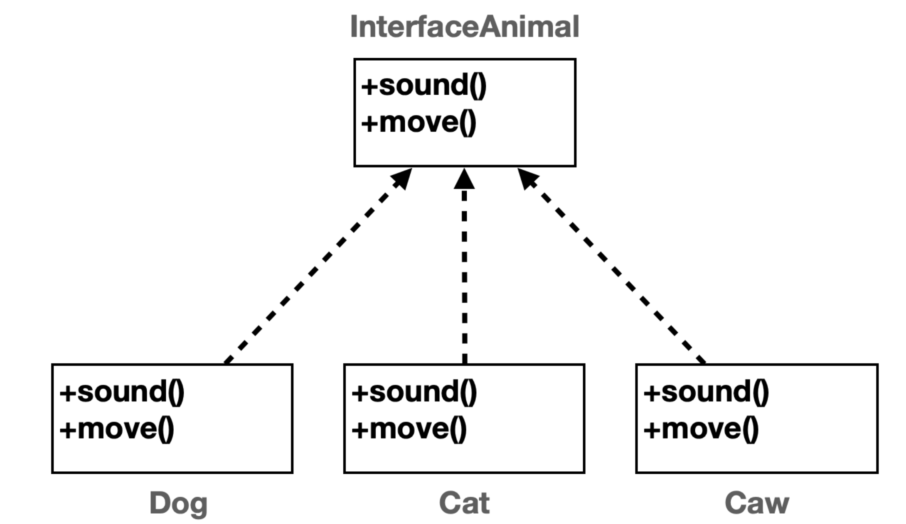
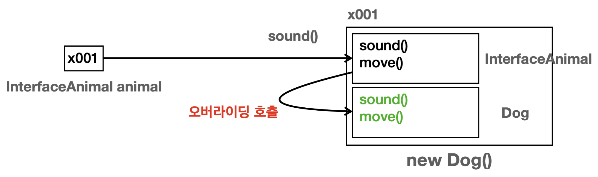
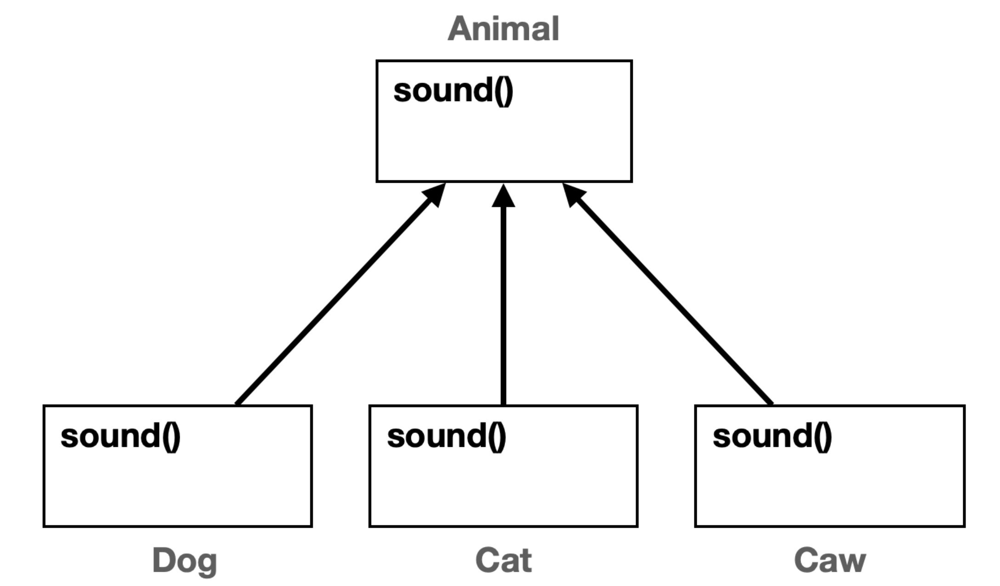

# 다형성 활용

## 중복 제거

타입이 다른데 비슷한 내용을 중복해야 할 때, 예를 들어 고양이, 개, 소와 같은 타입이 다른 클래스의 이름이 같은 메서드 sound()를 실행할 때 각각 사용하려면 중복이 발생할 수 밖에 없다.

### 다형성 활용



- 다형성을 사용하기 위해 상속 관계를 사용한다. 부모 클래스를 만들고 같은 메서드를 정의 해준다.
⇒ 이는 자식 클래스에서 오버라이딩할 목적으로 생성

```java
public class Animal {
    public void sound() {
				System.out.println("동물 울음 소리"); 
		}
}
public class Dog extends Animal {
		@Override
    public void sound() {
		System.out.println("멍멍"); 
		}
}

public class Cat extends Animal {
    @Override
		public void sound() {
		System.out.println("냐옹");
		} 
}

public class Caw extends Animal{
    @Override
		public void sound() { 
		System.out.println("음매");
		} 
}

public class AnimalPolyMain1 {
    public static void main(String[] args) {
        Dog dog = new Dog();
        Cat cat = new Cat();
        Caw caw = new Caw();
        soundAnimal(dog);
        soundAnimal(cat);
        soundAnimal(caw);
}
//동물이 추가 되어도 변하지 않는 코드
private static void soundAnimal(Animal animal) {
		System.out.println("동물 소리 테스트 시작"); 
		animal.sound();
		System.out.println("동물 소리 테스트 종료"); 
		}
}

/* 
실행 결과
동물 소리 테스트 시작 
멍멍
동물 소리 테스트 종료
동물 소리 테스트 시작 
냐옹
동물 소리 테스트 종료
동물 소리 테스트 시작
음매
동물 소리 테스트 종료

*/
```

위 코드의 핵심은 `Animal animal`  부분이다.

- **다형적 참조** 덕분에 animal 변수는 자식들을 모두 참조할 수 있다 ⇒ 부모는 자식을 담을 수 있다.
- **메서드 오버라이딩** 덕분에 `animal.sound()` 를 호출해도 각 자식의 sound 메서드를 호출할 수 있다.
- 다형성 덕분에 새로운 동물을 추가하더라도 다음 코드를 그대로 재사용이 가능하다.

배열과 for문을 사용하면 아래와 같이 수정이 가능하다.

```java
public class AnimalPolyMain2 {
     public static void main(String[] args) {
         Dog dog = new Dog();
         Cat cat = new Cat();
         Caw caw = new Caw();
         Animal[] animalArr = {dog, cat, caw};
         // Animal[] animalArr = new Animal[]{dog, cat, caw};
				//변하지 않는 부분
				for (Animal animal : animalArr) {
						System.out.println("동물 소리 테스트 시작"); 
						animal.sound();
						System.out.println("동물 소리 테스트 종료");
				} 
		}
}
```

- 배열과 메서드 모두 활용한 코드로 수정하면 아래와 같습니다.

```java
package poly.ex2;
 public class AnimalPolyMain3 {
     public static void main(String[] args) {
         Animal[] animalArr = {new Dog(), new Cat(), new Caw()};
         for (Animal animal : animalArr) {
         soundAnimal(animal);
         }
}
//동물이 추가 되어도 변하지 않는 코드
private static void soundAnimal(Animal animal) {
		System.out.println("동물 소리 테스트 시작"); 
		animal.sound();
		System.out.println("동물 소리 테스트 종료");
		} 
}
```

- Animal이라는 추상적인 부모를 참조하기 때문에 새로운 동물을 추가하더라도 메서드는 코드 변경 없이 유지할 수 있다.
- 여기까지 모든게 순조로워 보이지만 두가지 문제가 남아 있다.
    1. Animal 클래스를 따로 생성할 수 있다는 문제
        - Animal 클래스는 추상적인 개념으로 dog, cat처럼 실제로 존재하는 것이 아니다. 다형성을 위해 필요로 만든 클래스이지 직접 인스턴스를 생성해서 사용하려고 만든 것이 아니다.
        - 하지만 Animal은 너무 쉽게 접근이 가능하여 누구나 인스턴스를 생성할 수 있다. 물론 제대로된 기능을 수행하지는 않는다.
    2. Animal의 자식 클래스에서 메서드를 오버라이딩하지 않을 가능성
        - 만약 따로 메서드를 오버라이딩하지 않으면 Animal의 메서드가 실행될 것이다.

---

# 추상 클래스

추상 클래스는 부모 역할을 하는 클래스를 제공하지만 실제로 생성되지 않는 클래스를 말한다.

그래서 실체인 인스턴스가 존재하지 않는다. 대신 상속을 목적으로 사용되고 부모 역할을 담당한다.

`abstract class AbstractAnimal {...}`

abstract ⇒ 추상이라는 의미

- `new AbstractAnimal()`와 같이 직접 인스턴스를 생성하지 못하는 제약이 추가된 것이다.

### 추상 메서드

- 부모 클래스를 상속 받는 자식 클래스가 반드시 오버라이딩 해야하는 메서드를 부모 클래스에 정의가 가능하다. 이를 추상 메서드라고 한다.
- 그래서 실체가 존재하지 않고 메서드 바디가 없다.

`public abstract void sound();` 

- **만약 클래스에 추상 메서드가 하나라도 존재하면 해당 클래스는 추상 클래스로 선언해야 한다.**
- **추상 메서드는 상속 받는 자식 클래스가 반드시 오버라이딩 해서 사용해야 한다.**

그래서 위에서 사용하던 Animal 클래스를 추상 클래스로 수정하면 아래와 같다.

```java
public abstract class AbstractAnimal {
    public abstract void sound();
    public void move() {
		    System.out.println("동물이 움직입니다."); 
		}
}
```

### 요약

- 추상 클래스로 선언하면 인스턴스를 생성할 문제를 근본적으로 방지해준다.
- 추상 메서드를 통해 실수로 자식 클래스가 오버라이딩 하지 않을 문제를 근본적으로 방지해준다.

### 순수 추상 클래스

- 모든 메서드가 추상 메서드인 추상 클래스
- 순수 추상 클래스의 모든 자식 클래스들은 추상 클래스의 모든 기능을 오버라이딩 해야 한다.
⇒ **상속하는 클래스는 모든 메서드를 구현해야 한다.**
- 모든 메서드가 추상 메서드이므로 코드를 실행할 바디 부분이 전혀 없다.
- 오직 다형성을 위해 부모 타입이라는 껍데기만 제공할 뿐이지 실행 로직은 전혀 가지고 있지 않는다.

---

# 인터페이스

자바에서 제공하는 순수 추상 클래스를 더 편리하게 사용할 수 있는 기능

인터페이스는 클래스가 아니라 `interface` 라는 키워드를 사용한다.

- **public abstract 키워드 생략 가능**

```java
public interface InterfaceAnimal {
		//public abstract void sound();
     void sound();
     void move();
 }
```

인터페이스는 순수 추상 클래스의 기능에 추가적으로 몇가지 편의 기능이 추가된다.

- 인터페이스의 메서드는 모두 public, abstract
- 메서드에 `public abstract` 를 생략할 수 있다. 참고로 생략이 권장
- 인터페이스는 다중 구현(다중 상속)을 지원
- 인터페이스에서 멤버 변수는 `public` , `static` , `final` 이 모두 포함되었다고 간주
- 관례상 상수는 대문자에 언더스코 어( `_` )로 구분



- 인터페이스를 상속 받을 때는 `extends`  대신에 `implements` 라는 구현이라는 키워드를 사용.
- 인터페이스는 그래서 상속 보다는 구현이라는 키워드를 사용한다.

```java
public class Dog implements InterfaceAnimal {
     @Override
			public void sound() { 
					System.out.println("멍멍");
			}
			
     @Override
     public void move() {
				System.out.println("개 이동"); }
		}
```



### 클래스, 추상 클래스, 인터페이스는 모두 똑같다

- 프로그램 코드, 메모리 구조상 모두 똑같다. ⇒ 자바에서는 모두 `.class` 로 다루어진다.
- 인터페이스는 순수 추상 클래스와 유사하다.

### 상속 vs 구현

상속은 부모의 기능을 물려 받는 것이 목적이다.

인터페이스는 모든 메서드가 추상 메서드다. 즉, 물려받을 기능이 없고 모든 메서드를 자식이 오버라이딩해서 기능을 구현해야 한다. ⇒ 인터페이스는 메서드 이름만 있는 설계도, 이 설계도를 가지고 하위 클래스에서 모두 구현해야 한다.

### 인터페이스를 사용해야 하는 이유

1. 제약
- 인터페이스를 구현하는 곳에서 인터페이스의 메서드를 반드시 구현해야하는 제약을 줌
1. 다중 구현
- 자바에서 클래스 상속은 부모를 하나만 지정할 수 있지만, 인터페이스는 부모를 여러명 두는 다중 구현이 가능하다.

## 인터페이스 다중 구현

- 자바에서 다중 상속이 불가능한 이유는 여러 부모의 같은 메서드 중 어떤 부모의 메서드를 사용해야 할지 결정해야 하는 문제가 발생하기 때문이다.
- 하지만 인터페이스는 자신이 구현을 가지지 않고 자식에서 무조건 오버라이딩으로 구현하기 때문에 위의 문제가 발생하지 않는다.

### 클래스와 인터페이스 활용

하나의 클래스 여러 인터페이스

상속은 하나만 할 수 있고 implements를 통한 인터페이스는 다중 구현할 수 있다. 둘이 함께 올 경우 상속을 먼저 적어야 한다.

`public class Bird extends AbstractAnimal implements Fly, Swim {`