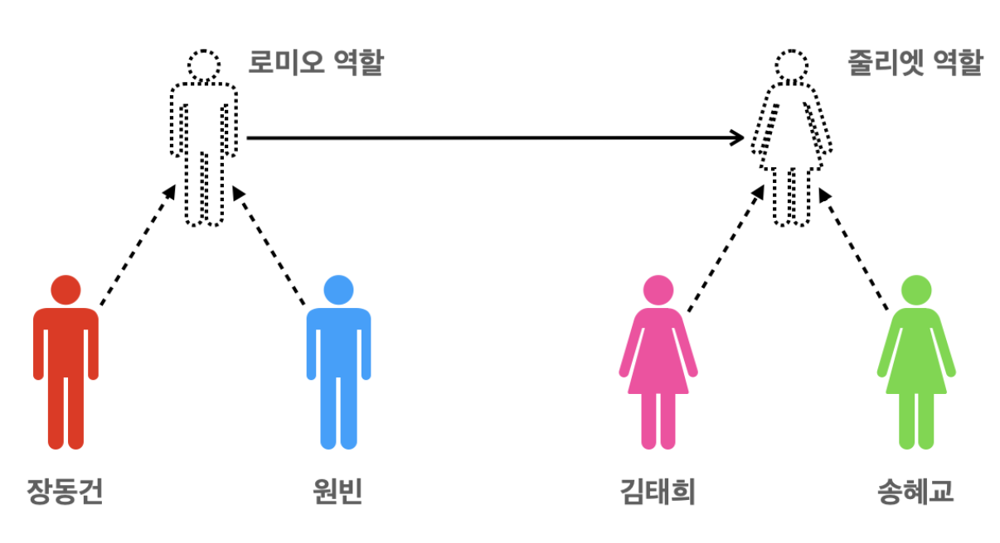
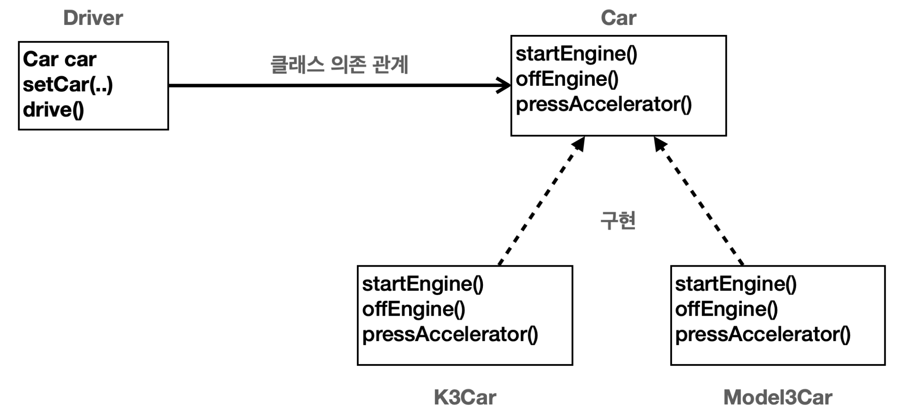
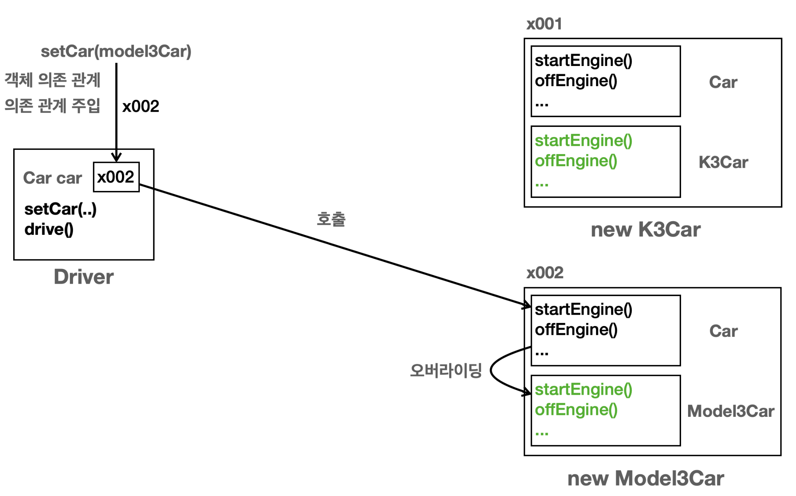
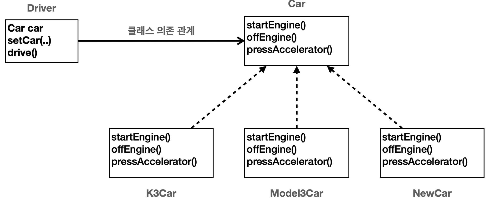
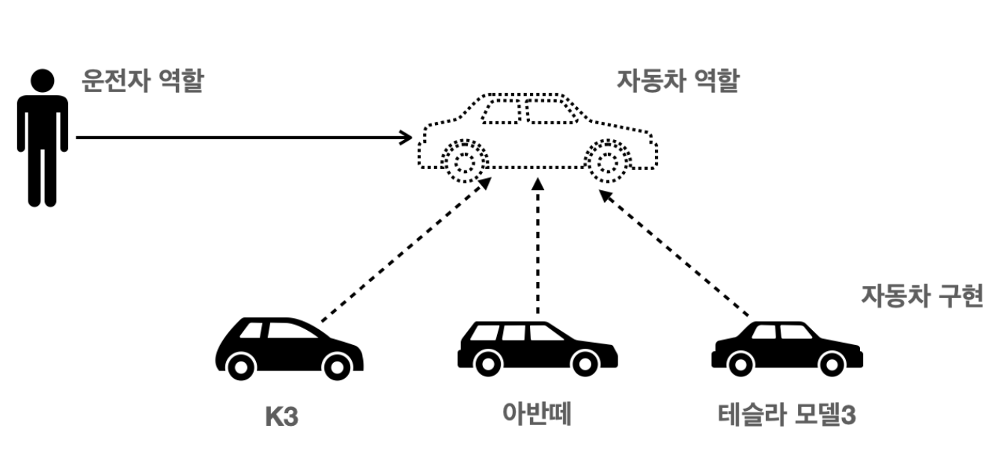

# 다형성과 설계

### 객체 지향 특징

- 추상화
- 캡슐화
- 상속
- 다형성

### 객체 지향 프로그래밍

- 컴퓨터 프로그램을 여러 개의 독립된 단위, 즉 객체들의 모임으로 파악하고자 하는 것
- 각 객체는 메세지를 주고 받고 데이터를 처리할 수 있다.
- 프로그램을 유연하고 변경이 용이하게 만들기 때문에 대규모 소프트웨어 개발에 많이 사용

### 다형성

- 역할과 구현으로 세상을 구분





- 프로그램이 단순해지고 유연해지며 변경도 편리해진다.
- 장점
    - 클라이언트는 대상의 역할만 알면 된다
    - 클라이언트는 구현 대상의 내부 구조를 몰라도 된다
    - 클라이언트는 구현 대상의 내부 구조가 변경되어도 영향을 받지 않음
    - 클라이언트는 구현 대상 자체를 변경해도 영향을 받지 않는다

### 자바에서 다형성 활용

- 역할 ⇒ 인터페이스
- 구현 ⇒ 인터페이스를 구현한 클래스, 구현 객체

객체를 설계 시 역할과 구현을 명확히 구분해준다

객체 설계 시 역할을 먼저 부여해주고 그 역할을 수행하는 객체 구현

### 다형성의 본질

- 인터페이스를 구현한 객체 인스턴스를 실행 시점에 유연하게 변경할 수 있다.
- 클라이언트를 변경하지 않고 서버의 구현 기능을 유연하게 변경할 수 있다

### 역할과 구현을 분리 한계

- 역할(인터페이스) 자체가 변하면 클라이언트, 서버 모두에 큰 변경이 발생

### 정리

- 다형성이 객체 지향 프로그램에서 가장 중요
- 디자인 패턴 대부분은 다형성을 활용
- 스프링의 제어의 역전(IoC), 의존 관계 주입(DI)도 결국 다형성을 활용하는 것이다.

---

## 다형성 역할과 구현 예제


- Driver : 운전자는 자동차( Car )의 역할에만 의존한다. 구현인 K3, Model3 자동차에 의존하지 않는다.
    - Driver 클래스는 Car car 멤버 변수를 가진다. 따라서 Car 인터페이스를 참조한다.
    - 인터페이스를 구현한 K3Car , Model3Car 에 의존하지 않고, Car 인터페이스에만 의존한다.
    - 여기서 설명하는 의존은 클래스 의존 관계를 뜻한다. 클래스 상에서 어떤 클래스를 알고 있는가를 뜻한다.
    Driver 클래스 코드를 보면 Car 인터페이스만 사용하는 것을 확인할 수 있다.
- Car : 자동차의 역할이고 인터페이스이다. K3Car , Model3Car 클래스가 인터페이스를 구현

```java
public interface Car {
    void startEngine();
    void offEngine();
    void pressAccelerator();
}

public class K3Car implements Car {
    @Override
    public void startEngine() {
        System.out.println("K3Car.startEngine");
		}
    @Override
    public void offEngine() {
        System.out.println("K3Car.offEngine");
    }
    @Override
    public void pressAccelerator() {
        System.out.println("K3Car.pressAccelerator");
    }
}

public class Model3Car implements Car {
    @Override
    public void startEngine() {
        System.out.println("Model3Car.startEngine");
		}
    @Override
    public void offEngine() {
        System.out.println("Model3Car.offEngine");
    }
    @Override
    public void pressAccelerator() {
        System.out.println("Model3Car.pressAccelerator");
    }
}
public class Driver {
    private Car car;
    
		public void setCar(Car car) { 
				System.out.println("자동차를 설정합니다: " + car); 
				this.car = car;
		}
		public void drive() { 
				System.out.println("자동차를 운전합니다."); 
				car.startEngine(); 
				car.pressAccelerator(); 
				car.offEngine();
				} 
}

/**
* 다형성을 활용한 런타임 변경
* 런타임: 애플리케이션 실행 도중에 변경 가능 */
public class CarMain1 {
    public static void main(String[] args) {
        Driver driver = new Driver();
        //차량 선택(k3)
				Car k3Car = new K3Car(); 
				driver.setCar(k3Car); 
				driver.drive();
				//차량 변경(k3 -> model3)
				Car model3Car = new Model3Car(); 
				driver.setCar(model3Car); 
				driver.drive();
		} 
}

```

- setCar(Car car) : 멤버 변수에 자동차를 설정한다. 외부에서 누군가 이 메서드를 호출해주어야 Driver는
새로운 자동차를 참조하거나 변경할 수 있다.
- drive() : Car 인터페이스가 제공하는 기능들을 통해 자동차를 운전한다.





## OCP(Open-Closed Principle) 원칙

- **Open for extension**: 새로운 기능의 추가나 변경 사항이 생겼을 때, 기존 코드는 확장할 수 있어야 한다.
- ***Closed for modification***: 기존의 코드는 수정되지 않아야 한다.
- 확장에는 열려있고, 변경에는 닫혀 있다는 뜻
- 기존의 코드 수정 없이 새로운 기능을 추가할 수 있 다는 의미

예시

- 새로운 차량 추가
    - 새로운 차량을 추가해도 `Driver` 의 코드는 전혀 변경하지 않는다.
    - 운전할 수 있는 차량의 종류가 계속 늘어나도 `Car` 를 사용하는 `Driver` 의 코드는 전혀 변경하지 않는다. 기능을 확장해도 `main()` 일부를 제외한 프로그램의 핵심 부분의 코드는 전혀 수정하지 않아도 된다.
    

    

### 확장에 열려있다.

- 인터페이스를 구현해서 기능을 추가할 수 있다는 의미.
- 인터페이스를 사용하여 클라이언트 코드도 인터페이스 통해 새롭게 추가된 구현을 자유롭게 호출할 수 있다.

### 수정은 닫혀 있다.

- 새로운 구현을 추가하면 당연히 기존 코드 수정은 불가피하다.
- **인터페이스의 기능을 사용하는 클라이언트의 코드를 수정하지 않아도 된다는 뜻**이다.
- `main()` 과 같이 새로운 구현을 클라이언트에게 전달해주는 역할은 당연히 수정이 발생한다.
- `main()` 은 전체 프로그램을 설정하고 조율하는 역할이다. 이런 부분은 OCP를 지켜도 변경이 필요

<aside>
💡 **전략 패턴(Strategy Pattern)**
디자인 패턴 중 가장 중요한 패턴. 클라이언트 코드 변경 없이 쉽게 변경에 용이.위에 설명한 코드가 바로 전략 패턴의 가장 좋은 예시이다. 인터페이스가 전략을 정의하고 각각의 구현이 전략의 구체적인 구현이다. 그리고 전략을 클라이언트 변경 없이 손쉽게 교체가 가능하다.

</aside>