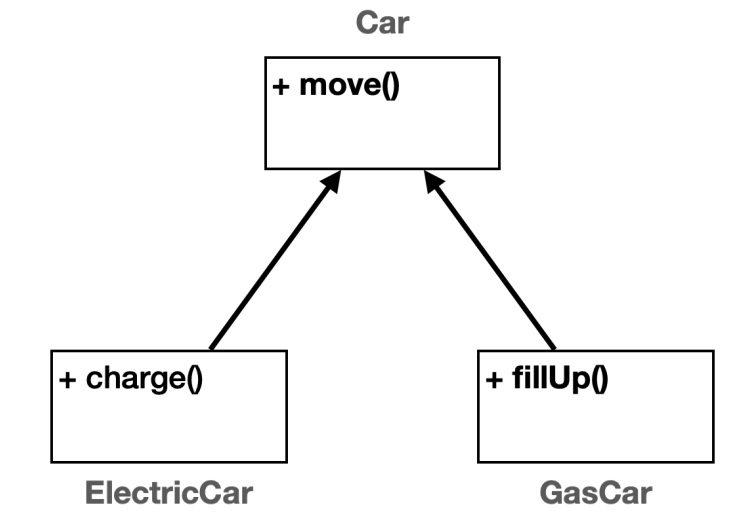
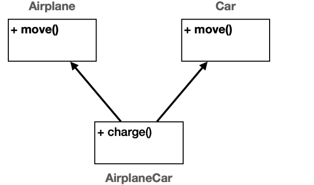
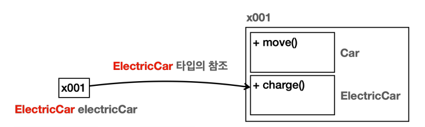
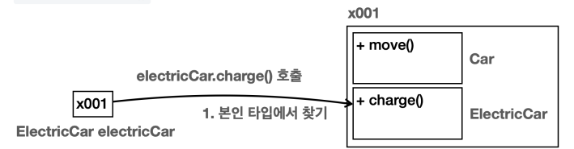
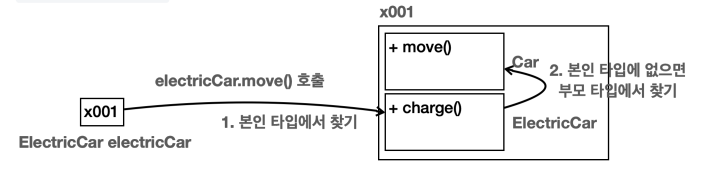
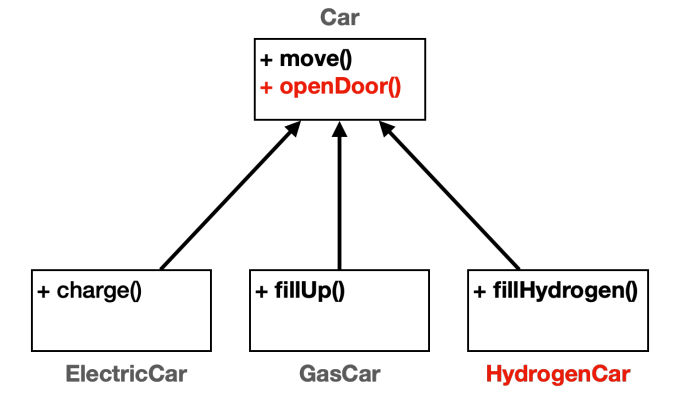
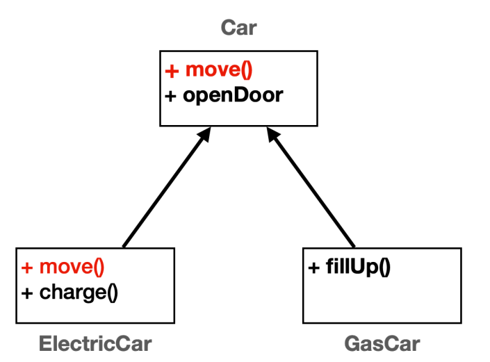
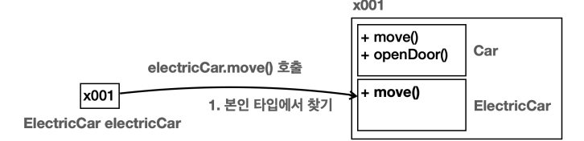
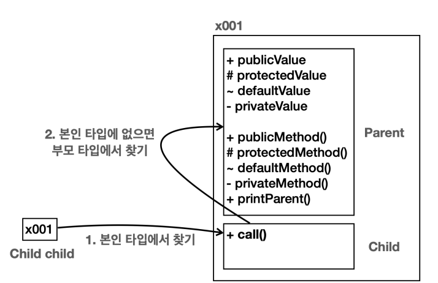

# 상속

**상속을 사용하는 경우**

두 가지 클래스에 같은 기능이 포함 되어있다면 상속을 사용하는 것이 효과적이다. 

예를 들어 전기차와 가솔린차를 비교한다면, 가솔린 차는 움직이는 기능과 주유 기능이 있고 전기차는 움직이는 기능과 충전 기능이 있다. 여기서 움직이는 기능은 공통되므로 상속을 이용하는 것이 좋다.

## 상속 관계

**기존에 있던 클래스의 필드와 메서드를 새로운 클래스에서 재사용**하는 방법. 이름 그대로 기존 클래스의 속성과 기능을 그대로 물려받는 것이다. 

상속을 사용하기 위해서는 `extends` 키워드를 사용

⇒ `extends` 대상은 하나만 선택 가능

```java
package extends1.ex2;
// 부모 클래스 Car
public class Car {
		public void move() {
				System.out.println("차를 이동합니다.");
 }
}

// 자식 클래스 ElectricCar
//Car를 상속 받는다
public class ElectricCar extends Car {
		public void charge() {
				System.out.println("충전합니다.");
 }
}

// 자식 클래스 GasCar
// Car를 상속 받는다
public class GasCar extends Car {
		public void fillUp() {
				System.out.println("기름을 주유합니다.");
 }
}

public class CarMain {
		public static void main(String[] args) {
				ElectricCar electricCar = new ElectricCar();
				electricCar.move();
				electricCar.charge();
				GasCar gasCar = new GasCar();
				gasCar.move();
				gasCar.fillUp();
 }
}
```



- 전기차와 가솔린차 모두 Car를 상속 받아서 move를 사용 가능하다.
- 자식이 부모의 기능을 물려 받는 것으로 부모가 자식의 기능에 접근은 못한다.

### 단일 상속

- 자바는 다중 상속을 지원하지 않는다. 그래서 extend 대상은 하나만 선택 가능하다.
- 아래의 예시를 보면 다중 상속일 때 AirplaneCar은 어느 move를 사용해야할지 곤란해지는 문제가 발생한다.



- 다중 상속을 사용하면 클래스 계층 구조가 매우 복잡해진다.
- 다중 상속은 후에 인터페이스의 다중 구현을 허용해서 해결한다.

---

## **상속과 메모리 구조**

- 상속 관계의 객체를 생성하면 그 내부에는 부모와 자식이 모두 생성된다.
- 상속 관계의 객체를 호출할 때 대상 타입을 정해야 한다. 호출자의 타입을 통해 대상 타입을 찾는다.
- 현재 타입에서 기능을 찾지 못하면 상위 부모 타입으로 기능을 찾아서 실행. 그래도 없으면 컴파일 에러 발생

> 예시
> 

**`ElectricCar electricCar = new ElectricCar();` ⇒ 상속 관계의 객체 생성**



- ElectricCar 뿐만 아니라 상속 관계에 있는 Car 까지 함께 포함해서 인스턴스를 생성
- 참조값은 하나지만 안에는 두 가지 클래스의 정보가 공존하는 것
- 상속을 하면 부모 클래스도 함께 포함해서 생성된다. 하나의 인스턴스를 생성한 것처럼 보이지만 내부에는 부모와 자식 모두 생성되고 공간도 구분된다.

**`electricCar.charge()` 호출**



- 호출하는 변수의 타입(클래스)을 기준으로 charge를 탐색하고 선택한다. electronicCar 변수의 타입이 `ElectricCar` 이므로 인스턴스 내부에 같은 타입인 `ElectricCar` 를 통해서 charge() 를 호출

**`electricCar.move()` 호출**



- ElectricCar 에는 move() 메서드가 없다.
- 이럴 경우 부모 타입으로 올라가서 해당 메서드를 찾고 호출한다.
- 만약 부모에서도 해당 기능을 찾지 못하면 그 상위 부모에게서 찾고 상위 부모가 없으면 컴파일 에러가 발생한다.

---

## 상속과 기능 추가

- 모든 자식 파일에 새로운 공통된 기능을 추가하고 싶을 때, 상속 관계가 형성되어 있다면 부모 클래스에 해당 기능을 추가해서 중복을 줄일 수 있다.
- 그리고 새로운 자식 클래스를 편리하게 확장할 수 있다.



- 위 사진처럼 부모 클래스인 Car에 문을 여는 기능인 openDoor()메서드를 추가해 주어 쉽게 모든 차에 새로운  기능을 추가할 수 있다.
- 그리고 새로운 수소차도 쉽게 추가가 가능하다.

---

## 상속과 메서드 오버라이딩

오버라이딩을 통해 부모 타입의 기능을 자식 클래스에서 다르게 재정의 할 수 있다.

```java
package extends1.ex2;
// 부모 클래스 Car
public class Car {
		public void move() {
				System.out.println("차를 이동합니다.");
 }
}

// 자식 클래스 ElectricCar
//Car를 상속 받는다
public class ElectricCar extends Car {
		// 부모의 move를 오버라이딩
		@Override
		public void move() {
				System.out.println("전기차를 빠르게 이동합니다.");
		}
		public void charge() {
				System.out.println("충전합니다.");
		}
}
```

- 위와 같이 오버라이딩을 하면 ElectricCar 의 move() 를 호출하면 Car 의 move() 가 아니라 ElectricCar 의 move() 가 호출된다.
- **@Override**
    - `@`이 붙으면 에노테이션이라고 한다. 주석과 비슷한데 주석은 개발자가 읽기 위해서라면  에노테이션은 **프로그램이 읽을 수 있는 특별한 주석**이다.
    - 이 에노테이션을 통해 상위 클래스의 메서드를 오버라이드하는 것임을 알 수 있다. 컴파일러는 이를 통해 제대로 오버라이드가 된 것인지 확인한다. 오버라이딩 조건을 만족하지 못했다면 컴파일 에러를 발생시켜 실수를 방지할 수 있다.
    
	
    

### 오버라이딩 메모리 구조



- electricCar.move() 를 호출
- ElectricCar 타입에 move() 메서드가 있다. 해당 메서드를 실행한다. 이때 실행할 메서드를 이미 찾았으므로 부모 타입을 찾지 않는다

### 오버로딩과 오버라이딩

- **오버로딩(Overloading)** : 메서드 이름이 같고 매개변수가 다른 메서드를 여러개 정의하는 것을 메서드 오버로딩이라고 한다. 같은 이름의 메서드를 여러개 정의했다고 이해하면 된다
- **오버라이딩(Overriding)** : 하위 클래스에서 상위 클래스의 메서드를 재정의하는 과정. 상속 관계에서 사용된다. 부모의 기능을 자식이 다시 정의하는 것. 자식의 새로운 기능이 부모의 기존 기능을 넘어 타서 기존 기능을 새로운 기능으로 덮어버린다고 이해하면 된다.
메서드 재정의이라고도 부른다.

### 메서드 오버라이딩 조건

1. **메서드 이름** : 메서드 이름이 같아야 한다
2. **메서드 매개변수** : 매개변수 타입, 순서, 개수가 같아야 한다.
3. **반환 타입** : 반환 타입이 같아야 한다.
4. **접근 제어자** : 오버라이딩 메서드의 접근 제어자가 상위 클래스의 메서드보다 더 제한적이면 안됨.
5. **static , final , private** : 키워드가 붙은 메서드는 오버라이딩 될 수 없다
6. **생성자** : 생성자는 오버라이딩 할 수 없다

---

## 상속과 접근 제어

간단히 접근 제어자를 복습하자면

- **private** : 모든 외부 호출을 막는다.
- **default** (package-private): 같은 패키지안에서 호출은 허용한다.
- **protected** : 같은 패키지안에서 호출은 허용한다. 패키지가 달라도 상속 관계의 호출은 허용한다.
- **public** : 모든 외부 호출을 허용한다.

순서대로 private 이 가장 많이 차단하고, public 이 가장 많이 허용한다.
private -> default -> protected -> public

- 부모 클래스인 Parent 에는 public , protected , default , private 과 같은 모든 접근 제어자가 필드와 메서드에 모두 존재한다.
- 자식 클래스인 Child 에서 부모 클래스인 Parent 에 얼마나 접근할 수 있을까?
- **public** : 모두 접근 가능하므로 접근할 수 있다.
- **protected** : 자식과 부모는 다른 패키지이지만, **상속 관계이므로 접근할 수 있다.**
- **default** : 자식과 부모가 다른 패키지이므로 접근할 수 없다
- **private** : private 은 모든 외부 접근을 막으므로 자식이라도 호출할 수 없다

### 메모리 구조



본인 타입에 없으면 부모 타입에서 기능을 찾는데, 이때 접근 제어자가 영향을 준다. 왜냐하면 객체 내부에서는 자식과 부모가 구분되어 있기 때문이다. 결국 자식 타입에서 부모 타입의 기능을 호출할 때, 부모 입장에서 보면 외부에서 호출한 것과 같다

---

## super 부모 참조

상속 관계를 사용하면 자식 클래스의 생성자에서 부모 클래스의 생성자를 반드시 호출해야 한다.

- 부모 클래스의 생성자가 기본 생성자(파라미터가 없는 생성자)인 경우에는 super() 를 생략할 수 있다

만약 부모의 생성자가 2개이면 어떻게 해야 할까?

- 생성자는 하나만 호출할 수 있다. 두 생성자 중 하나를 선택해야 한다.
- 예를 들어 ClassB 생성자가 아래와 같이 2개이면
    - ClassB(int a)
    - ClassB(int a, int b)
- ClassB의 자식 클래스인 ClassC는 둘 중 하나를 선택해야 한다.

```java
package extends1.super2;
public class ClassC extends ClassB {
		public ClassC() {
				super(10, 20);
				System.out.println("ClassC 생성자");
		}
}
```

이를 실행 시켜 보면 최상위 부모부터 실행되어서 하나씩 아래로 내려온다. 초기화는 최상위 부모에서 이루어진다.

- 상속 관계에서 생성자 호출은 결과적으로 부모에서 자식 순서로 실행 ⇒ 그래서 부모 먼저 초기화하고 자식의 데이터를 초기화한다.
- 상속 관계에서 자식 클래스의 생성자 첫줄에 반드시 super()를 호출해야한다. 하지만 기본 생성자인 경우는 생략 가능하다.
- this()를 사용하더라도 반드시 한번은 super를 호출해야한다.