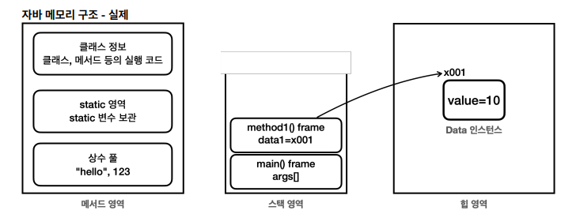
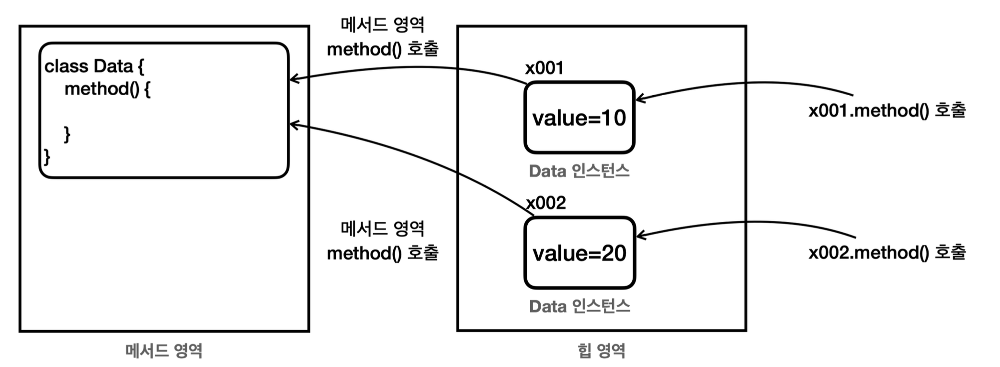
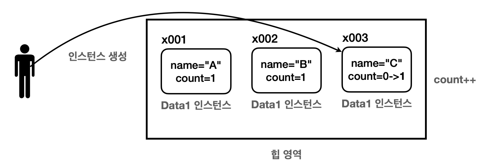
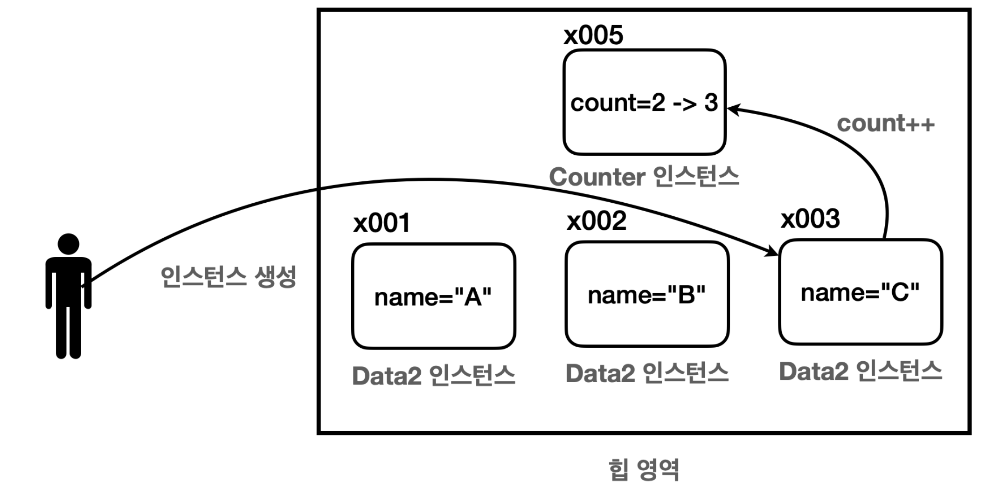
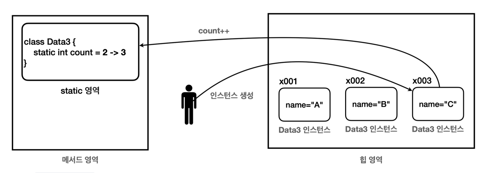

# 자바 메모리 구조



## 자바 메모리 구조

### 메서드 영역

- 프로그램을 실행하는데 필요한 공통 데이터를 관리, 이 영역은 프로그램의 모든 영역에소 공유 가능
- 클래스 정보를 저장 ⇒ 여기서 클래스 정보가 붕어빵 틀과 같다.
⇒ 클래스의 실행 코드, 필드, 메서드와 생성자 코드 등 모든 실행 코드가 존재
- **`static`** 영역 : `static` 변수들을 저장
- 런타임 상수 풀 : 프로그램을 실행하는데 필요한 공통 리터럴 상수를 보관, 프로그램을 효율적으로 관리하기 위한 상수들을 관리.

### 스택 영역

- 자바 실행 시 하나의 스택이 생성.
- 각 스택의 프레임은 지역 변수, 중간 연산 결과, 메서드 호출 정보 등을 포함
- 실제 프로그램 실행 영역, 메서드가 실행될 때마다 하나씩 쌓인다.
- 지역 변수(매개 변수 포함)는 스택 영역에서 관리한다
- 스택 프레임 : 스택 영역에 쌓이는 네모 박스가 하나의 스택 프레임이다. 메서드를 호출할 때 마다 하나의 스택 프레임이 쌓이고, 메서드가 종료되면 해당 스택 프레임이 제거
- 스택 프레임이 종료되면 지역 변수도 같이 제거된다.
- 스택 프레임이 모두 종료되면 프로그램도 종료

### 힙 영역

- 객체 (인스턴스)가 생성되는 영역
- new 명령어를 사용하면 이 영역을 사용한다. ⇒ 붕어빵 틀로 부터 생성된 붕어빵이 존재하는 영역.
- 배열도 이 영역에서 생성된다.
- 더 이상 참조되지 않는 객체는 제거된다.

<aside>
💡 같은 클래스로 부터 여러 개의 객체가 생성될 때, 각각의 인스턴스 변수에는 힙 영역에 메모리가 할당되지만 메서드에 대한 새로운 메모리 할당은 없다. 메서드는 메서드 영역에서 공통으로 관리되고 실행. 인스턴스의 메서드를 호출하면 실제로는 메서드 영역에 있는 코드를 불러서 수행.

</aside>




---

## `static` 변수

주로 멤버 변수나 메서드에 사용

### 멤버 변수에 `static` 이 필요한 이유

예를 들어 생성할 인스턴스 내부에 생성된 인스턴스의 수를 세주는 count 를 저장한다고 생각해보자.

```jsx
package static1;
 public class Data1 {
     public String name;
     public int count;
     public Data1(String name) {
         this.name = name;
         count++;
    } 
}
```

아래는 객체를 생성하고 카운트 값을 출력하는 클래스다

```jsx
package static1;
 public class DataCountMain1 {
     public static void main(String[] args) {
         Data1 data1 = new Data1("A");
         System.out.println("A count=" + data1.count);
         Data1 data2 = new Data1("B");
         System.out.println("B count=" + data2.count);
         Data1 data3 = new Data1("C");
         System.out.println("C count=" + data3.count);
     }
}
```

이를 실행시켜 보면 원하던 결과가 아닌 아래와 같은 결과가 나타난다.

```jsx
A count=1
B count=1
C count=1
```

이는 각 객체를 생성할 때마다 인스턴스는 새로 만들어지는데, 이 과정에서 `count` 변수도 새로 만들어지기 때문이다. 인스턴스에서 사용 되는 멤버 변수 `count` 값은 인스턴스끼리 공유되지 않는다. 문제를 해결하기 위해 변수를 서로 공유해야 한다.




### 외부 인스턴스에 카운트 값 저장

```jsx
package static1;
 public class Counter {
     public int count;
}
```

이 객체를 공유하면 필요할 때마다 카운트 값을 증가시킬 수 있다.

```jsx
package static1;
 public class Data2 {
     public String name;
     public Data2(String name, Counter counter) {
         this.name = name;
         counter.count++;
    } 
}
```

```jsx
package static1;
 public class DataCountMain2 {
     public static void main(String[] args) {
         Counter counter = new Counter();
         Data2 data1 = new Data2("A", counter);
         System.out.println("A count=" + counter.count);
         Data2 data2 = new Data2("B", counter);
         System.out.println("B count=" + counter.count);
         Data2 data3 = new Data2("C", counter);
         System.out.println("C count=" + counter.count);
     }
}

```

실행 결과는 원하던 대로 나오게 된다. counter 인스턴스를 공용으로 사용한 덕분에 객체를 생성할 때마다 값을 정확하게 증가시킬 수 있다.




- 결과적으로 원하는 바를 이루었지만, 이러면 Counter라는 별도의 클래스를 사용해야 하고, 생성자의 매개변수도 추가되어 생성자랑 생성자 호출이 복잡해진다.

### static 변수 사용

- 이처럼 특정 클래스에서 공용으로 사용할 수 있는 변수를 만들기 위해 `static`키워드를 사용한다.

```jsx
package static1;
 public class Data3 {
    public String name;
    public static int count; //static
    public Data3(String name) {
        this.name = name;
        count++;
    } 
}
```

- 변수 타입 앞에 static이 붙었는데, 이는 해당 멤버 변수가 정적 변수 또는 클래스 변수라고 선언을 한 것이다.

```jsx
package static1;
 public class DataCountMain3 {
     public static void main(String[] args) {
         Data3 data1 = new Data3("A");
         System.out.println("A count=" + Data3.count);
         Data3 data2 = new Data3("B");
         System.out.println("B count=" + Data3.count);
         Data3 data3 = new Data3("C");
         System.out.println("C count=" + Data3.count);
     }
}
```

- 정적 변수에 접근하는 방법은 `클래스명.정적변수명` . 마치 클래스에 직접 접근하는 것 처럼 보인다.




- 메서드에 있는 static 값이 증가하는 것을 볼 수 있다.

<aside>
💡 static 변수는 클래스에서 관리하는 특별한 변수이다. 클래스도 하나이기 때문에 클래스 변수도 하나만 존재한다. 반면 인스턴스 변수는 인스턴스 수만큼 존재한다.

</aside>

### 용어 정리

**멤버 변수의 종류**

- **인스턴스 변수** : `static` 이 붙지 않은 멤버 변수
    - 인스턴스를 생성해야 사용할 수 있고, 인스턴스에 소속되어 있음.
    - 인스턴스가 생성될 때마다 새로 만들어 짐
- **클래스 변수 :** `static` 이 붙은 멤버 변수
    - 클래스 변수, 정적 변수, static 변수로 불림
    - 인스턴스와 무관하게 클래스에 바로 접근해서 사용 가능, 클래스 자체에 소속되어 있음.
    - 여러 곳에서 공유하는 목적으로 사용된다.
    
    <aside>
    💡 **변수의 생명 주기**
    1. **지역 변수** : 스택 영역에 있는 스택 프레임에 보관. 메서드가 종료되면 스택 프레임 삭제와 동시에 같이 제거됨, 그러므로 생명 주기가 짧다.
    2. **인스턴스 변수** : 인스턴스 변수는 힙 영역에 저장. 참조만 계속 되고 있다면(가비지 컬랙션이 발생하기 전) 생존하기 때문에 지역 변수보다는 생명 주기가 긴 편이다.
    3. **클래스 변수** : static 영역에서 보관하는 변수. 메서드 영역은 프로그램 전체에서 사용하는 공용 공간. 클래스 변수는 해당 클래스가 JVM에 로딩 되는 순산 생성. 그리고 JVM이 종료될 때까지 생명 주기가 이어진다.
    
    </aside>
    

### 정적 변수 접근 방법

클래스를 통해서 접근할 수 있고 인스턴스를 통해 접근할 수도 있다.

```jsx
//인스턴스를 통한 접근
Data3 data4 = new Data3("D"); System.out.println(data4.count);
//클래스를 통합 접근
System.out.println(Data3.count);
```

정적 변수의 경우 인스턴스를 통한 접근은 추천하지 않는다. 왜냐하면 코드를 읽을 때 마치 인스턴스 변수에 접근하는 것 처럼 오해할 수 있기 때문

---

## static 메서드

메서드 앞에 `static`을 사용.

정적 변수처럼 인스턴스 생성 없이 클래스 명을 통해서 바로 호출할 수 있음.

이런 정적 메서드는 인스턴스 생성 없이 클래스 명을 통해서 바로 호출 가능하다.

`클래스명.정적메서드명` 

### 정적 메서드 사용 방법

- static 메서드는 static만 사용 가능
    - 클래스 내부의 기능을 사용할 때, 정적 메서드는 **static이 붙은 정적 메서드나 정적 변수만 사용 가능**
    - 클래스 내부의 기능을 사용할 때, 인스턴스 변수나 메서드는 사용 불가
- 대신 모든 static 호출 가능
    - 정적 메서드는 말 그대로 공용 기능이다. 접근 제어자만 허락한다면 클래스를 통해 모든 곳에서 static을 호출할 수 있다.

```jsx
package static2;
 public class DecoData {
    private int instanceValue;
    private static int staticValue;
		public static void staticCall() {
		    //instanceValue++; //인스턴스 변수 접근, compile error 
		    //instanceMethod(); //인스턴스 메서드 접근, compile error
		    staticValue++; //정적 변수 접근
        staticMethod(); //정적 메서드 접근 }
    public void instanceCall() { 
        instanceValue++; //인스턴스 변수 접근 
        instanceMethod(); //인스턴스 메서드 접근
        staticValue++; //정적 변수 접근
        staticMethod(); //정적 메서드 접근 }
    private void instanceMethod() {
        System.out.println("instanceValue=" + instanceValue);
     }
    private static void staticMethod() {
        System.out.println("staticValue=" + staticValue);
     }
}
```

- 정적 메서드는 정적인 메서드나 변수에는 접근할 수 있지만, 인스턴스 변수나 메서드에 접근 시 에러 발생
- 인스턴스 메서드는 모든 변수나 메서드에 접근이 가능하다.

<aside>
💡 **정적 메서드가 인스턴스 기능을 사용할 수 없는 이유**
정적 메서드는 클래스를 통해 바로 호출이 가능하다. 그래서 인스턴스처럼 참조값의 개념이 없음.
특정 인스턴스를 사용하려면 참조값을 알아야 하는데, 정적 메서드는 참조값 없이 호출한다. 따라서 정적 메서드 내부에서 인스턴스 변수나 인스턴스 메서드를 사용할 수 없음.
물론 객체의 참조값을 직접 매개변수로 전달하면 정적 메서드도 인스턴스 변수나 메서드 호출 가능

```java
public static void staticCall(DecoData data) {
     data.instanceValue++;
     data.instanceMethod();
}
```

</aside>

### 정적 메서드 활용

- 객체 생성 필요 없이 메서드의 호출만으로 필요한 기능을 수행할 때 주로 사용
- 간단한 메서드 하나로 끝나는 유틸리티성 메서드에 자주 사용.

### 정적 메서드 접근 방법

정적 메서드도 정적 변수처럼 클래스를 통해 바로 접근할 수 있고, 인스턴스를 통해서도 접근이 가능하다.

```java
//인스턴스를 통한 접근
DecoData data3 = new DecoData(); data3.staticCall();
//클래스를 통한 접근
DecoData.staticCall();
```

둘의 차이는 없지만, 이도 코드를 읽을 때 마치 인스턴스 메서드인 것처럼 오해할 수 있기 때문에 클래스를 통해 접근하는 것이 좋다.

### static import

`import static` 을 통해 클래스 명을 생략하고 메서드를 호출할 수 있다.

```java
package static2;
 //import static static2.DecoData.staticCall;
 import static static2.DecoData.*;
 public class DecoDataMain {
public static void main(String[] args) { 
		System.out.println("1.정적 호출");
	  staticCall(); //클래스 명 생략 가능
		...
		}
```

### main() 메서드와 정적 메서드

**main() 메서드** : 인스턴스 생성 없이 실행하는 가장 대표적인 메서드

- 프로젝트의 시작점
- 객체 생성 없이 작동하는 이유 ⇒ static이기 때문
    - 정적 메서드는 정적 메서드만 호출할 수 있다. 그러니 main()이 호출하는 메서드에는 정적 메서드를 활용한다.
    - 정적 메서드는 같은 클래스 내부의 정적 메서드만 호출할 수 있다. 따라서 정적 메서드인 main() 메서드가 같은 클래스에서 호출하는 메서드도 정적 메서드로 선언해서 사용