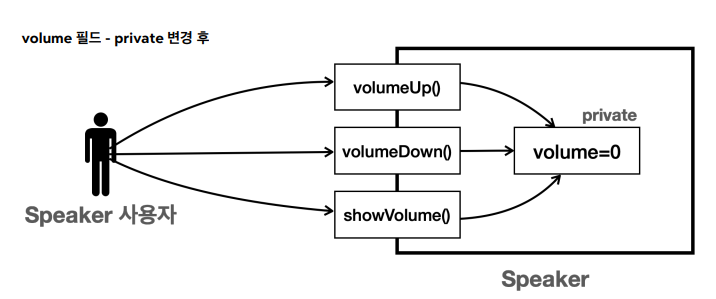

# 접근 제어자

**접근 제어자**는 클래스를 외부에 특정 필드나 메서드에 접근하는 것을 허용하거나 제한할 수 있다.

접근 제어자가 필요한 이유는 예를 들어 쉽게 이해할 수 있다. 하나의 스피커를 만든다고 생각해보자. 만약 내가 스피커를 설계할 때, 기본 기능으로 볼륨, 볼륨 업, 다운 기능을 구현했다고 하자. 나는 여기서 스피커 성능을 고려해서 최대 볼륨을 100으로 설정해 놨다. 여기서 다른 직원이 이 스피커에 접근했을 때 볼륨에 제한이 없을 경우 이 직원이 최대 볼륨을 올려버리면 스피커 자체 고장을 낼 수 있다. 이런 상황을 방지하게 위해 필요하다.

## 접근제어자 종류

접근 제어자는 필드와 메서드, 생성자에 사용된다. 추가로 클래스 레벨에서도 일부 사용 가능하다.

### private 접근 제어자

모든 외부 호출을 막음. 해당 클래스 내부에서만 호출할 수 있다.



이제 외부에서 접근하려면 자바 컴파일 오류가 발생한다.

현재 클래스 안에서 속성과 기능을 숨길 때 사용한다.

### default

패키지 private. 같은 패키지 내에서는 호출을 허락해준다.

접근 제어자를 명시하지 않으면 default 접근 제어자가 적용된다.

현재 패키지 안에 속성과 기능을 숨길 때 사용

### protected

같은 패키지 안에서 호출을 허용. 패키지가 달라도 상속 관계의 호출은 허용

상속 관계로 속성과 기능을 숨길 때 사용

상속 관계가 아니면 호출 불가능

### public

기능을 숨기지 않고 모든 외부 호출을 허용한다.

---

## 접근 제어자 사용

```java
package access.a;

public class AccessData {
    public int publicField;
    int defaultField;
    private int privateField;
    public void publicMethod() {
        System.out.println("publicMethod 호출 "+ publicField);
    }
    void defaultMethod() {
        System.out.println("defaultMethod 호출 " + defaultField);
    }
    private void privateMethod() {
        System.out.println("privateMethod 호출 " + privateField);
    }
    public void innerAccess() {
        System.out.println("내부 호출");
        publicField = 100;
        defaultField = 200;
        privateField = 300;
        publicMethod();
        defaultMethod();
        privateMethod();
    }
}

```

- `public`, `private`, `default` 을 필드와 메서드로 사용
- `innerAccess()` 같은 경우 내부 호출로, `private`을 포함한 모든 곳에 접근이 가능한다.

이제 외부에서 접근을 해보면

```java
package access.a;

public class AccessInnerMain {
    public static void main(String[] args) {
        AccessData data = new AccessData();
        //public 호출 가능
        data.publicField = 1;
        data.publicMethod();
        //같은 패키지 default 호출 가능
        data.defaultField = 2;
        data.defaultMethod();
        //private 호출 불가
        //data.privateField = 3;
        //data.privateMethod();
        data.innerAccess();
    }

}
```

- `public`은 모두 쉽게 접근이 가능하다.
- 그리고 같은 패키지 않에 위치한 클래스로 `default`에도 쉽게 접근이 가능하다.
- 하지만 `private`은 `AccessData` 클래스 내부에서만 접근 가능하므로 여기서 접근이 불가능하다.
- 다만 `innerAccess()` 메서드는 외부에서 호출되었지만 `AccessData`에 포함되므로 이 메서드 안에서는 `private` 필드와 메서드에 모두 접근이 가능하다.

---

## 접근 제어자 사용 - 클래스 레벨

클래스 레벨의 접근 제어자는 `public`과 `default`만 사용 가능

`public` 클래스는 반드시 파일명과 이름이 같아야 한다.

- 하나의 자바 파일에는 하나의 `public` 클래스만 존재 가능
- 대신 `default`를 사용하는 클래스는 무한정 가능하다.

## 캡슐화

객체 지향 프로그래밍에서 중요한 개념 중 하나. 

데이터와 해당 데이터를 처리하는 메서드를 하나로 묶어서 외부에서의 접근을 제한하는 방법. 데이터의 직접적인 변경을 방지 및 제한.

속성과 기능을 하나로 묶고 외부에는 꼭 필요한 기능만 노출시키는 방식이다. 

접근 제어자는 캡슐화를 안전하게 완성할 수 있게 해주는 장치

<aside>
💡 **데이터는 모두 숨기고, 기능은 꼭 필요한 기능만 노출하는 것이 좋은 캡슐화이다.**

</aside>

### 1. 숨기는 데이터

가장 필수 숨기는 것은 **데이터 (속성)**

위에서 접근 제어자를 설명할 때 예로 들었던 스피커의 볼륨을 숨긴다고 생각하면 된다.

객체 내부의 데이터를 외부에서 함부로 접근하면, 클래스 안에서 데이터를 사용하는 모든 로직들을 무시하고 데이터를 변경해 버릴 수 있다.

캡슐화를 망가트리는 요인이 된다.

**객체의 데이터는 객체가 제공하는 기능인 메서드를 통해서 접근해야 한다**

### 2. 숨기는 기능

객체의 기능 중 외부에서는 사용하면 안되고 내부에서만 사용해야하는 기능들이 존재한다. 이런 기능을 사용자들에게 알리면 사용자가 너무 많은 정보에 접근이 가능해진다. 사용자에게는 꼭 필요한 기능만 노출 시키자.