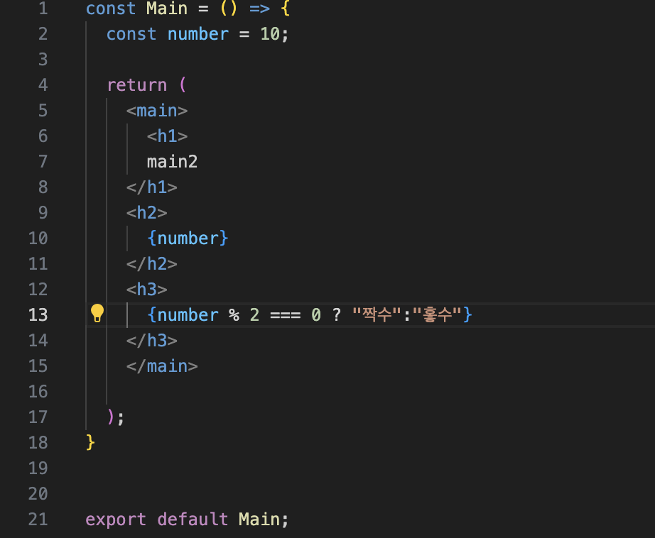
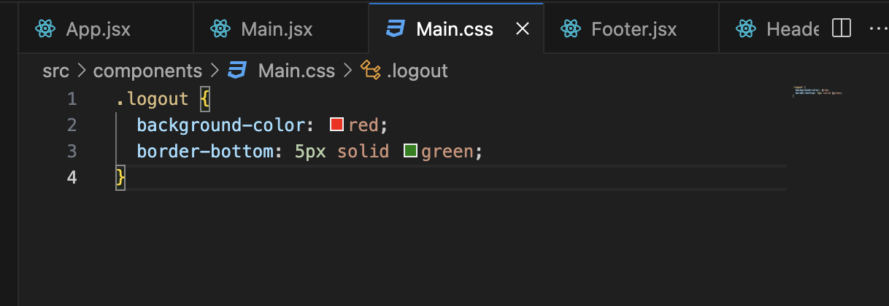
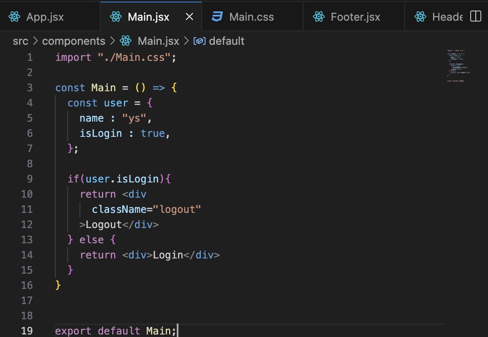
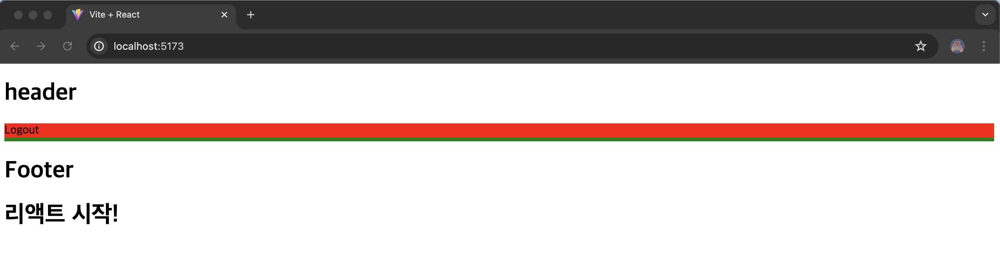

# JSX로 UI 표현하기

### JSX란?

확장된 자바스크립트의 문법을 말함 ⇒ 자바스크립트 내부에 HTML을 포함시킬 수 있음



### 주의 사항

1. 중괄호 내부에는 자바스크립트 표현식만 넣을 수 있다. ⇒ 조건이나 반복문 불가
2. 숫자, 문자열, 배열 값만 랜더링 된다. ⇒ 객체값 같은 값은 랜더링 불가
3. 모든 태그는 닫혀있어야 한다.
4. 최상위 태그는 반드시 하나여야만 한다 ⇒ 위 코드를 보자면  main태그 위에 div 태그를 만들 경우 오류가 발생한다.

---

## 스타일 적용하는 방법

1. 인라인 방식

중괄호 2겹을 사용하여 안에 설정을 입력한다.

```jsx
const Main = () => {
  const user = {
    name : "ys",
    inLogin : true,
  };

  if(user.isLogin){
    return <div
      style={{
        backgroundColor:"red",
        borderBottom:"Spx solid blue",
      }}
    >Logout</div>
  } else {
    return <div>Login</div>
  }
}

export default Main;
```

1. CSS 파일 생성

Main.css 파일을 따로 만들어서 import를 통해 적용 시킨다.







<aside>
💡 JSX에서 자바스크립트와 HTML을 같이 사용하고 있기 때문에 class를 사용할 수 없다.
대신 나온 것이 바로 className이다.

</aside>