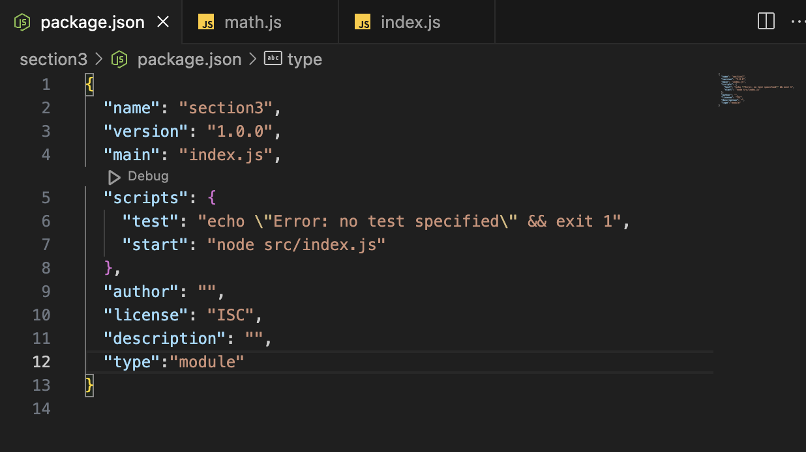

# Node.js란?

Node.js란 자바스크립트의 실행 환경이라고 할 수 있다. ⇒ 구동기, 자바스크립트 코드를 실행시키는 스위치같은 느낌

### 왜 만들어졌을까?

자바스크립트는 웹 페이지 내부 필요한 아주 단순한 기능만을 개발하기 위해 만들어짐

매우 유연하게 설계되었고 생산성이 매우 높음.

### Node.js 설치

node.js를 검색해서 LTS버전을 다운 받는다.

그리고 터미널에서

`node -v` 를 입력해서 버전을 확인해보자.

같이 다운되는 npm도 무사히 다운로드 되었는지 `npm -v` 로 확인해보자.

## 패키지

node.js에서 사용하는 프로그램 단위

`npm init`  : 패키지 생성

모두 엔터를 눌러줘서 생성하면 폴더 안에 package.json으로 생성

**package.json :** 현재 프로젝트에 관한 정보와 패키지 매니저(npm)를 통해 설치한 모듈들의 의존성을 관리하는 파일이다.

- **dependencies** 안에는 해당 모듈의 버전과 이름이 추가된다

이제 같은 파일 안에 위치한 자바스크립트 파일을 `node index.js` 같이 입력하여 실행시킬 수 있다.

- 만약 src라는 폴더 안에 존재한다면 경로를 바꿔서`node src/index.js` 같이 실행시키면 된다.
- 그리고 만약 경로가 너무 복잡할 경우 package.json의 scripts 안에 매크로를 설정해줄 수 있다.

그 후 `npm run start` 를 실행하면 해당 경로 자바스크립트를 실행 시켜준다.

---

## 모듈 시스템

### 모듈이란?

- 기능별로 파일을 분리해서 깔끔하게 관리되는 자바스크립트 파일들을 모듈이라고 부른다
- 모듈을 생성하고 불러오고 사용하는 등의 모듈을 다루는 다양한 기능을 제공하는 시스템을 모듈 시스템이라고 한다.
- Common JS, ESModule이 대표적

## 모듈로부터 특정 값을 내보내는 방법 : CJS

`module.exports` 를 통해 내보낼 함수를 작성 해준다.

- 사용할 때는 `require(”./해당 자바스크립트 파일);` 로 가져온다

- 하나의 객체에 넣어도 되고 아래 처럼 중괄호를 사용해 바로 사용이 가능하다.

## ESM ⇒ 리액트에서도 사용하는 최신식 모듈 시스템

<aside>
💡 주의 : 모듈 시스템은 같이 쓸 수 없다. 하나의 모듈 시스템만 사용

</aside>

- package.json에 `"type":"module"` 를 추가해주면 ESM 사용 가능
- 하지만 이제 CJS는 사용 불가다. 모듈 시스템은 하나씩만 사용 가능

- `export{}` 로 원하는 함수들을 내보내 줄 수 있고

- `import` 를 통해 가져와서 사용 가능하다.
- 다만 여기서 주의해야 할 점은 해당 자바스크립트 파일을 쓸 때 확장자를 꼭 써줘야한다.

- `export`로 따로 써주는게 귀찮으면 함수 앞에 `export` 를 추가해서 바로 내보내 줄 수 있다.

- 기본값으로써 내보내는 경우 default
- import할 때 중괄호 없이 가져온다

---

# 라이브러리

**npmjs**를 검색해보면 자바스크립트에서 사용 가능한 라이브러리들을 검색해볼 수 있다.

`npm i randomcolor` 를 통해 라이브러리를 다운 받아주면 `node_modules` 파일과 `package-lock.json`이 추가된 것을 볼 수 있다.

그리고 `package.json` 코드 안에 `depedencies` 안에 `“randomcolor”`가 추가된 것을 볼 수 있다

- `import`를 사용해서 가져와서 사용 가능

`npm i`  : 한 번 설치되어서 패키지.json에 기록된 라이브러리들은 모두 다시 다운 받을 수 있다.

- 그러니 공유할 때 불필요한 `node_modules` 는 지우고 공유하는 것이 좋다.