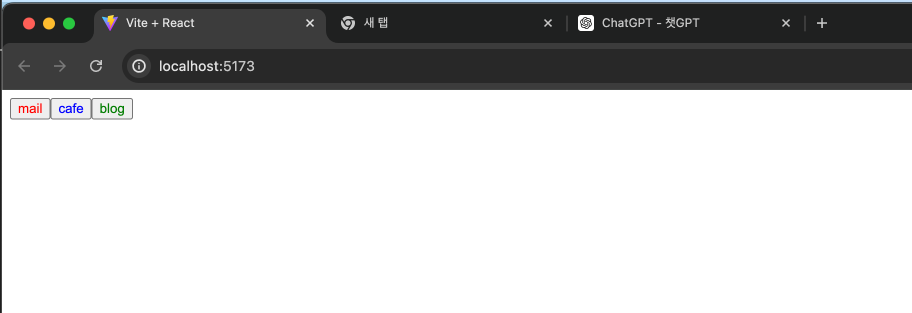
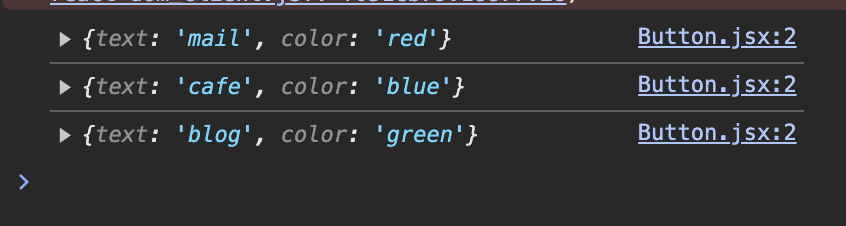
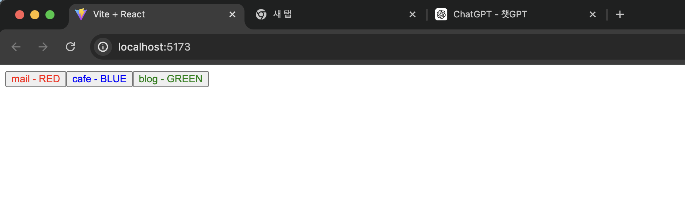
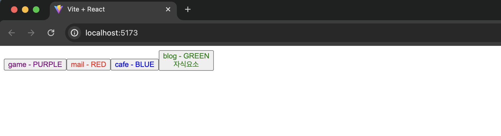

# Props로 데이터 전달하기

## Props란?

부모 컴포넌트가 자식 컴포넌트에게 원하는 값을 전달하는 것이 가능하다.

```jsx
function App() {
   return (
       <>
           <Button text={"메일"} img={"mail.png"}/>
           <Button text={"카페"} img={"cafe.png"}/>
       <>
   );
}
```

여기서 전달되는 값들을 Props라고 부른다.

마치 함수처럼 컴포넌트에 주는 Props에 따라 다른 UI들을 랜더링하는 것이 가능하기 때문에 리액트의 핵심 기술로 통함.

```jsx
//App.jsx
import Button from "./components/Button";

function App() {
  return (
    <>
      <Button text={"mail"} color={"red"} />
      <Button text={"cafe"} color={"blue"} />
      <Button text={"blog"} color={"green"} />
    </>
  );
}

export default App;
```

```jsx
// Button.jsx
const Button = (props) => {
  console.log(props);
  return <button style={{ color: props.color }}>{props.text}</button>;
};

export default Button;
```





```jsx
const Button = (props) => {
  console.log(props);
  return (
    <button style={{ color: props.color }}>
      {props.text} - {props.color.toUpperCase()}
    </button>
  );
};

// props.color에 아무런 값이 설정되지 않았음에도
// 자동으로 black으로 설정되기 때문에
// toUpperCase 같은 메서드를 사용해도 오류 없이 사용이 가능하다
Button.defaultProps = {
  color: "black",
};

export default Button;
```



```jsx
// props 객체 형태로 넘어옴
// 바로 해당 값으로 받아와서 코드를 깔끔하게 만들어 줄 수 있음
const Button = ({ text, color }) => {
  return (
    <button style={{ color: color }}>
      {text} - {color.toUpperCase()}
    </button>
  );
};
```

```jsx
import Button from "./components/Button";

function App() {
  // 보내줘야 할 값들이 많은 경우 객체로 묶어서 보내줄 수 있다
  const ButtonProps = {
    text: "game",
    color: "purple",
    a: 1,
    b: 2,
    c: 3,
  };
  //spread 연산자를 활용
  return (
    <>
      <Button {...ButtonProps} />
      <Button text={"mail"} color={"red"} />
      <Button text={"cafe"} color={"blue"} />
      <Button text={"blog"} color={"green"} />
    </>
  );
}

export default App;
```

### 자식 요소

HTML 요소나 리액트 요소를 전달할 수 있다. 자동으로 children이라는 props로 전달된다.

```jsx
import Button from "./components/Button";

function App() {
  // 보내줘야 할 값들이 많은 경우 객체로 묶어서 보내줄 수 있다
  const ButtonProps = {
    text: "game",
    color: "purple",
    a: 1,
    b: 2,
    c: 3,
  };
  //spread 연산자를 활용
  return (
    <>
      <Button {...ButtonProps} />
      <Button text={"mail"} color={"red"} />
      <Button text={"cafe"} color={"blue"} />
      <Button text={"blog"} color={"green"}>
        <div>자식요소</div>
      </Button>
    </>
  );
}

// Button.jsx
const Button = ({ text, color, children }) => {
  return (
    <button style={{ color: color }}>
      {text} - {color.toUpperCase()}
      {children}
    </button>
  );
};
Button.defaultProps = {
  color: "black",
};

export default Button;
```


