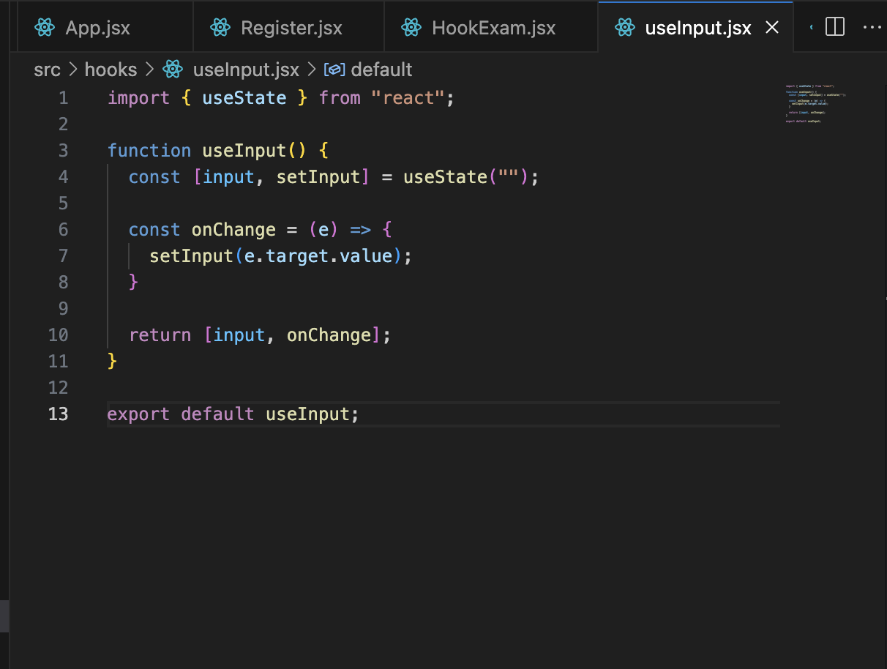
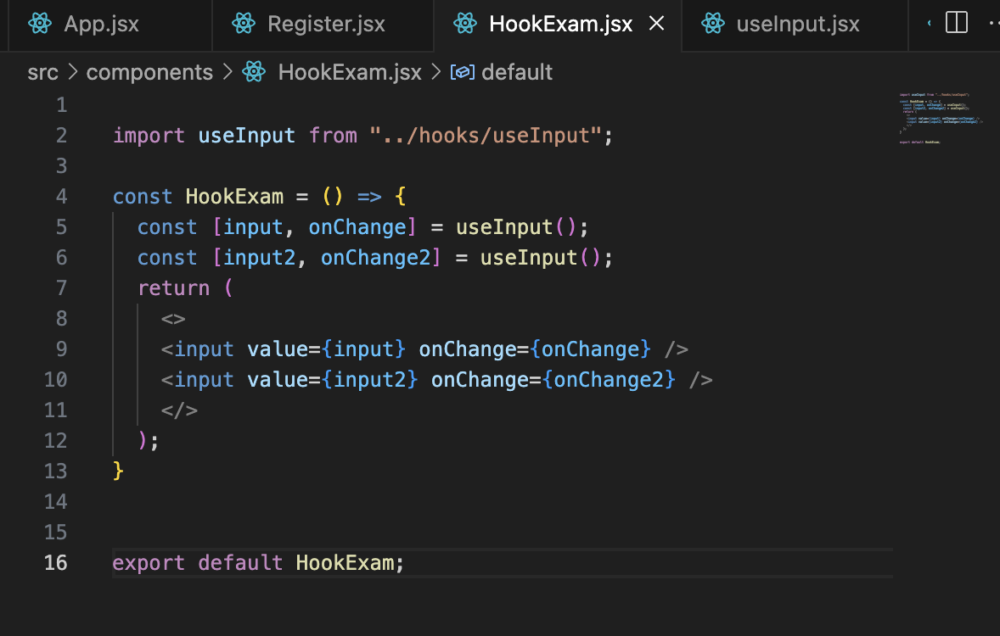

# React Hooks

## React Hooks란?

클래스 컴포넌트의 기능을 함수 컴포넌트에서도 이용할 수 있도록 도와주는 메서드들

굳이 문법이 복잡한 클래스 컴포넌트를 사용하지 않아도 되게 해줌

useState, useRef 모두 react hooks에 해당

이름 앞에 use 접두사가 붙으면 react hooks다 

조건부와 반복문에서 호출은 불가능하다

use를 사용하여 직접 나만의 훅을 커스텀 할 수도 있다.

## 3가지 Hook 팁

1. 함수 컴포넌트, 커스텀 훅 내부에서만 호출 가능
2. 조건문 또는 반복문으로 호출 불가능
3. **나만의 커스텀 훅을 직접 만들 수 있다**

```jsx
import { useState } from "react";

// 함수 이름 접두사에 use가 붙으면 리액트 자체에서 훅으로 인식하게 된다
function useInput() {
  const [input, setInput] = useState("");

  const onChange = (e) => {
    setInput(e.target.value);
  }

  return [input, onChange];
}

const Hookexam = () => {
  const [input, onChange] = useInput();
  const [input2, onChange2] = useInput();
  return (
    <>
    <input value={input} onChange={onChange} />
    <input value={input2} onChange={onChange2} />
    </>
  );
}

export default Hookexam
```

### 반복되는 로직을 따로 파일로 구분



