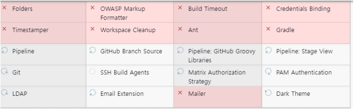
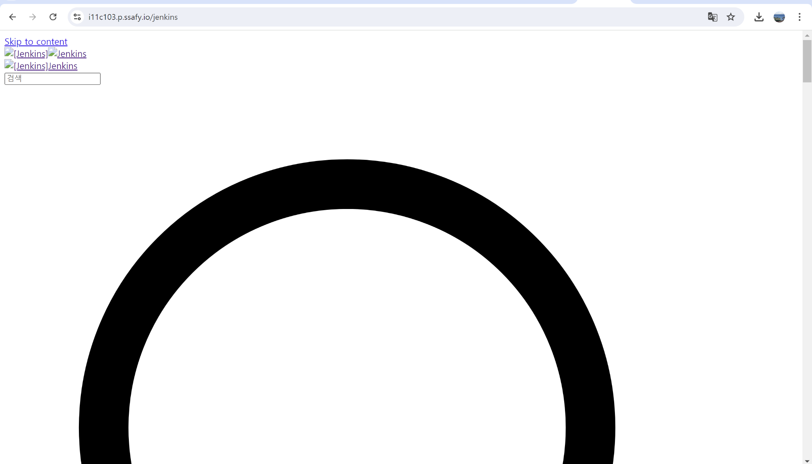

# jenkins

태그: 백엔드, 인프라

## 젠킨스 플러그인 설치 오류



처음 젠킨스 이미지를 받을 때 lts로 받을 경우, Folders에서 기본적으로 요구하는 젠킨스 버전보다 낮은 버전을 받아서 플러그인 설치를 못한다. 

이를 해결하기 위해 `latest`로 설치를 하든 Folder에서 요구하는 버전을 설치해준다.

---

## Nginx https 경로 연결

`sudo nano /etc/nginx/sites-available/damda`

```java
server {
    listen 80;
    server_name i11c103.p.ssafy.io;

    rewrite        ^ https://$server_name$request_uri? permanent;
}

server {
    listen 443 ssl;
    server_name [서버 이름 ];

    ssl_certificate /etc/letsencrypt/live/i11c103.p.ssafy.io/fullchain.pem; # managed by Certbot
    ssl_certificate_key /etc/letsencrypt/live/i11c103.p.ssafy.io/privkey.pem; # managed by Certbot
    include /etc/letsencrypt/options-ssl-nginx.conf; # managed by Certbot
    ssl_dhparam /etc/letsencrypt/ssl-dhparams.pem; # managed by Certbot

    location / {
        proxy_pass http://localhost:8080/;
        proxy_set_header X-Real-IP $remote_addr;
        proxy_set_header X-Forwarded-For $proxy_add_x_forwarded_for;
        proxy_set_header Host $http_host;
    }

    location /jenkins {
        proxy_pass http://localhost:8081/jenkins/;
        proxy_set_header X-Real-IP $remote_addr;
        proxy_set_header X-Forwarded-For $proxy_add_x_forwarded_for;
        proxy_set_header X-Forwarded-Proto $scheme;
        proxy_set_header Host $host;
        proxy_redirect http://localhost:8081/jenkins/ https://i11c103.p.ssafy.io/jenkins/;

    }

}

```

---

## Nginx 연결 시 css 깨짐 현상



사진처럼 Nginx 경로 추가 시 생기는 css 깨짐 현상은 단순히 젠킨스 컨테이너를 실행할 때 환경 변수를 줌으로써 해결 가능하다.
 `-e JENKINS_OPTS="--prefix=/jenkins”` 

```java
docker run -d \
  -p 8081:8080 \
  -p 50000:50000 \
  --name my-jenkins \
  -e JENKINS_OPTS="--prefix=/jenkins" \
  -v /home/ubuntu/jenkins-data:/var/jenkins_home \
  my-jenkins:latest

```

---

## 도커 안에 도커 설치

- /var/run/docker.sock 파일에 대해 Jenkins 사용자가 읽기 및 쓰기 권한을 가지고 있는지 확인

`sudo chmod 666 /var/run/docker.sock`

- 도커 컨테이너 실행 ⇒ 도커 소켓을 마운트하는 방식 추가
- 루트로 실행

```java
sudo docker run -d \
-p 8081:8080 \
-p 50000:50000 \
--name jenkins \
-e JENKINS_OPTS="--prefix=/jenkins" \
-v /home/ubuntu/jenkins-data:/var/jenkins_home \
-v /var/run/docker.sock:/var/run/docker.sock \
-u root \
jenkins/jenkins:latest

```

```java
# jenkins container 접속
docker exec -it jenkins /bin/bash
 
# linux 버전 확인
cat /etc/issue
# --------------- OS --------------------------------
# root@DESKTOP-R4P59B3:/home/opendocs# cat /etc/issue
# Ubuntu 20.04.4 LTS \n \l
# --------------- jenkins Container OS --------------------------------
# root@DESKTOP-R4P59B3:/home/opendocs# docker exec -it jenkins /bin/bash
# root@8fc963af71bb:/# cat /etc/issue
# Debian GNU/Linux 11 \n \l
 
# Docker 설치
## - Old Version Remove
apt-get remove docker docker-engine docker.io containerd runc
## - Setup Repo
apt-get update
apt-get install \
    ca-certificates \
    curl \
    gnupg \
    lsb-release
mkdir -p /etc/apt/keyrings
curl -fsSL https://download.docker.com/linux/debian/gpg | gpg --dearmor -o /etc/apt/keyrings/docker.gpg
echo \
  "deb [arch=$(dpkg --print-architecture) signed-by=/etc/apt/keyrings/docker.gpg] https://download.docker.com/linux/debian \
  $(lsb_release -cs) stable" | tee /etc/apt/sources.list.d/docker.list > /dev/null
## - Install Docker Engine
apt-get update
apt-get install docker-ce docker-ce-cli containerd.io docker-compose-plugin
```

- 만들어진 컨테이너를 이미지로 만들어 준다.

```java
sudo docker commit jenkins jenkins-with-docker:latest
```

- 만들어진 이미지로 새로 컨테이너를 만들어준다. ( 그전에 전에 실행한 젠킨스 컨테이너 삭제)

```java
sudo docker stop jenkins
sudo docker rm jenkins

sudo docker run -d \
-p 8081:8080 \
-p 50000:50000 \
--name jenkins-with-docker \
-e JENKINS_OPTS="--prefix=/jenkins" \
-v /home/ubuntu/jenkins-data:/var/jenkins_home \
-v /var/run/docker.sock:/var/run/docker.sock \
jenkins-with-docker:latest

```

[[Setting | Docker] jenkins 설치 내부에서 docker 실행](https://blog.opendocs.co.kr/?p=704)

---

## fatal: not in a git directory 에러 발생

워크스페이스 청소를 통해 해결함.

```java
stage('Clean Workspace') {
            steps {
                cleanWs()
            }
        }
```

- 최종 플러그인

```java
pipeline {

    agent any

environment {
    DOCKER_IMAGE = 'ssafy/damda'
    CONTAINER_NAME = 'damda'
    GIT_CREDENTIALS_ID = 'e383bb7f-f528-4c1e-99d9-671bc6d5d97f'
    GIT_URL = 'https://lab.ssafy.com/s11-webmobile3-sub2/S11P12C103.git'
    GIT_BRANCH = 'master'
    
}

stages {
    stage('Clean Workspace') {
        steps {
            cleanWs()
        }
    }
        
    stage('Pull from GitLab') {
        steps {
            git branch: "${GIT_BRANCH}", 
                credentialsId: "${GIT_CREDENTIALS_ID}", 
                url: "${GIT_URL}"
        }
    }
    
    stage('Backend Build') {
        steps {
            dir('back/shoppingMart') {
                script {
                    try {
                        sh 'chmod +x ./gradlew'
                        sh './gradlew clean build -Pprod'
                    } catch (e) {
                        error "Gradle build failed"
                    }

                    try {
                        sh "docker rm -f ${CONTAINER_NAME} || true"
                        sh "docker rmi ${DOCKER_IMAGE} || true"
                        sh "docker build -t ${DOCKER_IMAGE} ."
                    } catch (e) {
                        error "Docker build or image removal failed"
                    }

                    try {
                        sh "docker run -d -p 8080:8080 --name ${CONTAINER_NAME} ${DOCKER_IMAGE}"
                    } catch (e) {
                        error "Docker run failed"
                    }
                }
            }
        }
    }
  }
}
```